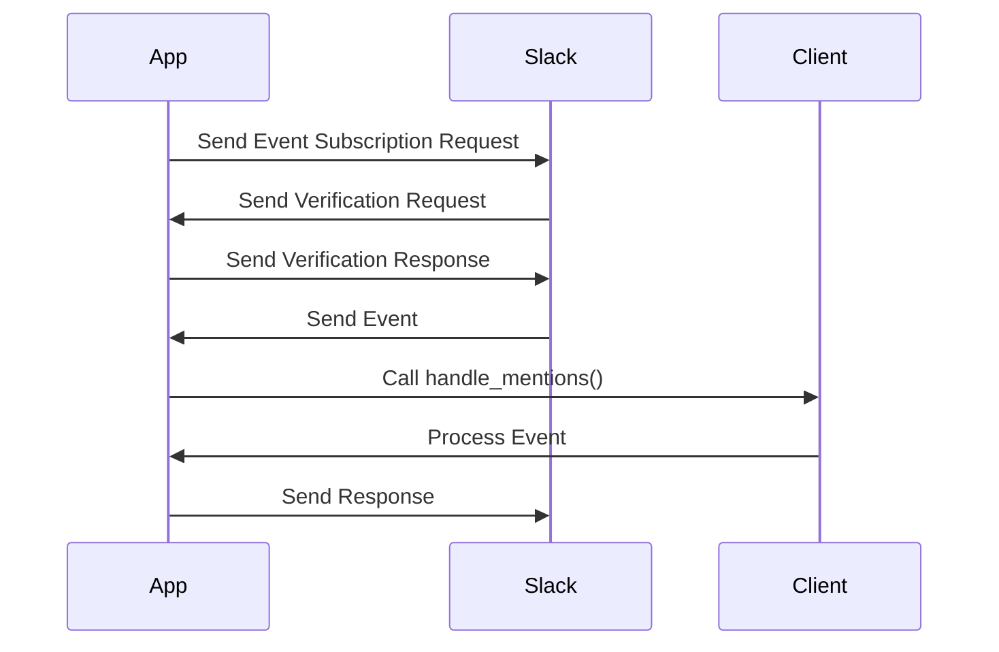
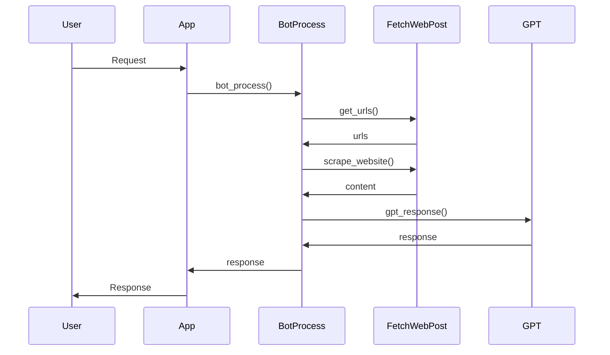
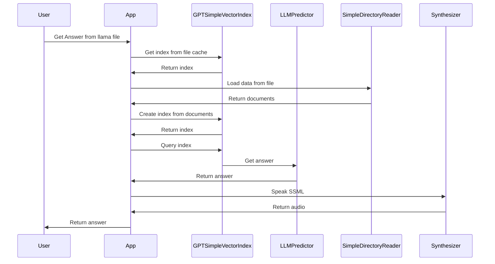

- [AI 背景知识](#ai-背景知识)
  - [生成式预训练模型（GPT: Generative Pre-trained Transformer）](#生成式预训练模型gpt-generative-pre-trained-transformer)
  - [大语言模型（LLM: Large Language Model）](#大语言模型llm-large-language-model)
  - [词向量检索](#词向量检索)
  - [Prompt](#prompt)
  - [Embedding](#embedding)
- [基于 chatGPT 的应用类型](#基于-chatgpt-的应用类型)
  - [套壳 chatGPT 应用](#套壳-chatgpt-应用)
  - [增强类 chatGPT 应用](#增强类-chatgpt-应用)
  - [Prompt 类应用](#prompt-类应用)
- [myGPTReader 应用架构](#mygptreader-应用架构)
- [myGPTReader 实现过程](#mygptreader-实现过程)
- [最后的思考](#最后的思考)

如何开发一个基于 chatGPT 的应用？答案就在问题里，那就是用 chatGPT 来开发基于 chatGPT 的应用。本文以笔者的一个开源项目 [myGPTReader](https://github.com/madawei2699/myGPTReader) 为例，分享我是如何基于 chatGPT 去开发这个系统的，这个系统的功能见这篇文章：[我的 AI 阅读助手](/self/my-gpt-reader/)。

为了探索 chatGPT 辅助开发的可能性，我在项目开发之初就记录了与 chatGPT 对话的过程，将近一个月的开发日志都记录在 [ChatGPT Driven Development Record](https://github.com/madawei2699/myGPTReader/blob/main/docs/CDDR.md) 这个文档里。

从最终的结果看，我的角色从开发变成了产品设计与测试，整个项目的代码我个人亲自编写的可能不到 10%，从后端服务到前端页面，甚至连 Logo 都是 AI 来完成的，Logo 的设计过程我也记录到了 [Midjourney Driven Design Record](https://github.com/madawei2699/myGPTReader/blob/main/docs/MDDR.md) 这个文件了。

更有意思的是，这个项目因缺少部署文档，使一些不了解技术但又想独立部署该项目的网友犯难，但最终他们与 chatGPT 反向去研究这个项目，竟然也能成功部署。

总之这是一个 chatGPT 含量极高的项目，无论是开发过程还是最终的功能。

## AI 背景知识

chatGPT 是一个基于 GPT-3.5/4 的开放 API，它的背后技术是基于 Transformer 网络的大型无监督语言模型，通过预训练和微调两个阶段的训练，能够学习自然语言的规则和结构，并且在各种下游任务上表现出色。从更大范围来说，chatGPT 是属于自然语言处理 (Natural Language Processing) 领域的一个大语言模型（Large Language Model）。

### 生成式预训练模型（GPT: Generative Pre-trained Transformer）

> 我: 你能给我说说chatGPT背后的技术吗？比如大语言模型，还有训练过程。
>
> chatGPT: 当谈到ChatGPT时，背后的技术通常是指OpenAI GPT（Generative Pre-trained Transformer）模型，这是一种使用Transformer网络架构进行预训练的大型语言模型。GPT是基于无监督学习技术构建的，该技术可以在没有标签的大量数据集上进行训练，以自动发现数据中的模式和结构。
> 
> GPT模型的训练过程分为两个阶段：预训练和微调。
>
> 预训练阶段使用一个大规模的无标签语料库，例如维基百科、新闻文章、小说等，通过预测给定文本序列中下一个单词的任务，对模型进行训练。这个任务被称为“语言模型”，因为模型被训练为理解自然语言中的上下文和语法规则，以便能够预测下一个单词。在这个过程中，GPT模型可以学习到自然语言的规则和结构，形成了通用的语言表示。
>
> 在预训练完成后，微调阶段使用少量的标记数据对模型进行微调，以适应特定的下游任务，例如问答、文本分类、生成对话等。微调过程通过反向传播梯度更新模型的权重，以最小化特定任务的损失函数。微调的过程可以增强模型对特定任务的理解能力，并且可以使模型在下游任务上表现更好。
>
> 总的来说，GPT模型的背后技术是基于Transformer网络的大型无监督语言模型，通过预训练和微调两个阶段的训练，能够学习自然语言的规则和结构，并且在各种下游任务上表现出色。

### 大语言模型（LLM: Large Language Model）

> 我: 大语言模型、GPT、Transformer三者的关系是？
> 
> chatGPT: 大语言模型、GPT、Transformer三者是密切相关的概念，它们在自然语言处理和深度学习领域有着广泛的应用。具体关系如下：
>
> Transformer是一种基于注意力机制的神经网络架构，最初是为了机器翻译任务而设计的。它由编码器和解码器组成，可以对序列数据进行建模，适用于在输入和输出之间存在长距离依赖关系的任务。
>
> 大语言模型是建立在Transformer架构基础上的语言模型，常见的大型预训练模型包括GPT、BERT等。大语言模型通过在大规模文本语料库上进行自监督预训练，能够捕捉到语言中的复杂结构与信息，从而在下游任务中取得很好的效果。
>
> GPT (Generative Pre-trained Transformer) 是一个基于Transformer架构和自监督预训练的句子级别自动生成模型，通常用于生成式任务，比如文本自动生成、摘要生成、对话系统等。
> 
> 因此，可以说，大语言模型是应用了Transformer架构并使用自监督预训练技术的模型，而GPT则是基于大语言模型构建的具体任务模型，两者都是Transformer架构在语言建模方面的应用。

一个奇怪的问题是，基于Transformer这种设计之初是为了机器翻译任务的模型，为什么在编写代码方面也表现良好？

> 我：为什么基于Transformer的GPT模型不仅可以用在翻译上，也能在在编写代码的任务上表现良好？
> 
> chatGPT: 1. 基于文本流的代码生成能力：现代软件开发通常包括对源代码的有效管理。生成源代码的技术需要考虑各种软件开发标准、API接口以及所有相关部分间相互影响的复杂性。GPT模型强大的自然语言理解能力使其能够有效生成高质量的源代码。
> 
> 2.上下文理解：代码通常是一个非常上下文相关的环境，特别是在功能相似但又具有微妙区别的不同代码块之间。 GPT模型能够根据上下文生成出更加匹配语法、且更加可读的代码。
>
> 3.词向量表达：源代码的语法是有结构的，并且它通常被认为属于DSL的元素构成的单词阵列。它的语法规则清晰，也容易编写非常明确的语义。GPT通过预训练的方式将从输入数据中获得的词向量检索作为核心基础，使用语言模型来编写高效、正确的代码。
>
> 因此，GPT模型在生成高质量源代码的任务方面也有很好的应用价值。

这里提到的一个关键技术：词向量检索，这在后面也会有所提及。

### 词向量检索

> 我: 什么是词向量检索？
>
> chatGPT: 词向量检索，也称为向量空间模型检索，是一种文本检索方法，其基本思想是将输入的文本转换为向量形式，并使用数学模型对文本相似度进行计算，从而寻找匹配的文本集合。
>
> 通常情况下，词向量检索分为以下几个步骤：
>
> 文本预处理：对原始文本进行分词、去除停用词等操作，以得到可供后续处理的单词列表。
>
> 向量表示：利用某种算法（如 word2vec）将每个单词映射为一个向量。这些向量通常具有较高的维数，并包含了单词的语义信息。
>
> 查询处理：将用户输入的查询文本转换为向量表示，与预处理过的文本向量进行相似度计算，以得到最相关的文本。
>
> 结果呈现：将计算出来的相似度得分排列，呈现给用户最相关的文本列表。
>
> 词向量检索在自然语言处理领域被广泛应用，常用于搜索引擎、推荐系统等场景。它能够通过对文本的向量化处理，更准确地衡量文本之间的相似度，达到更精确和快速的文本检索效果。

### Prompt

> 我: 什么是AI中的Prompt？
> 
> chatGPT: 在AI中，Prompt指的是提供给模型的文本或指令，可以用来初始化和引导模型生成一系列类似自然语言的输出。Prompt通常由一个或多个片段组成，其中每个片段都是一种语言形式或主题，用于定义AI模型需要生成的文本的内容和样式。
>
> Prompt可以以多种方式使用，例如：
>
> 作为AI机器人对用户的响应：当一个用户与AI交互时，机器人会根据用户输入的信息和之前的上下文来生成回答。Prompt可以用作机器人生成响应的指南，确保AI产生的回复与预期的主题和风格相一致。
>
> 作为生成AI初始文本的输入：某些AI工具（如GPT-3）可以根据给定的Prompt生成文本。这可以用于快速创建文章、电子邮件、Twitter帖子等等，并且可以扩展已有的草稿或以不同的风格和语言复述相同的消息。
>
> 总之，Prompt在AI中是非常重要和有用的，因为它们可以让模型更加定向地生成特定类型或主题的字符串或句子。

> 我: 为什么一定要用Prompt？Prompt未来还会存在吗？
>
> chatGPT: 在AI中，“Prompt”是指提供给模型的输入文本，它是用来启发模型生成输出的。Prompt通常是一些简短的话语或问题，向模型传递一些先验知识或上下文信息，以帮助模型更好地理解和执行任务。
>
> 在许多自然语言处理(NLP)应用中，prompt对于准确预测输出至关重要。例如，一个对话系统可能需要给出一个明确的提示，让用户提供足够的上下文信息来回答问题，或者一个分类器需要在prompt下面添加一个标签，以便识别正确的类别。
> 虽然在AI中，Prompt广泛使用并且非常有用，但未来是否会一直使用它们取决于技术的演进。可能会出现新的方式帮助模型更好的理解上下文信息，消除Prompt所起到的作用，但是现阶段仍然有很多领域弥补不了这个作用，因此Prompt仍然是一种不可替代的输入形式。

### Embedding

> 我: openAI的embedding是什么？
>
> chatGPT: OpenAI的Embedding是一种将词语或句子转换成密集向量的技术。这些向量可以用于自然语言处理任务，如文本分类，情感分析和机器翻译等。
>
> 在OpenAI的Embedding中，每个单词或句子都会被映射到一个向量空间中的点。与传统的one-hot编码不同，Embedding可捕获词语之间的相似性和关系，并使得机器学习算法能够更好地理解自然语言表达的含义。
>
> 例如，在情感分析中，通过使用Embedding，我们可以将具有相似情感倾向的单词或短语映射到相似的向量空间中的位置。这样，我们就可以使用这些向量来训练机器学习模型，以帮助它们更准确地预测文本的情感。

## 基于 chatGPT 的应用类型

由于 chatGPT 的功能实在过于强大，导致应用端能做的功能并不多，目前已知的一些应用类型有以下几种。

### 套壳 chatGPT 应用

这类应用主要是对接 chatGPT 的 API 或调用 web 端的接口，自身并没有太多的功能，只是将 chatGPT 的功能进行了封装。而这类应用又细分为两种：

- 工具类应用。需要用户提供自己的 OpenAI API Key 来使用，如很多APP或浏览器插件。
- 代理服务类。不需要用户提供自己的 OpenAI API Key，而是通过代理服务来使用 chatGPT 的 API。

### 增强类 chatGPT 应用

由于 chatGPT 本身不是联网的，无法获取最新的数据，且输入的 Token 也是有最大限制的，因此这类应用主要是为 chatGPT 突破这些限制而设计的，比如通过爬虫获取最新的数据，然后通过 chatGPT 来生成新的文本或总结这些文字，或者通过 Embedding 的方式将大量的文本向量化，然后把文本节点与向量化的组合存储到特殊设计的索引中，然后把用户输入的 Token 向量化后，通过词向量检索寻找相关的上下文，然后把这些上下文与用户输入的 Prompt 一同提交给 chatGPT 来获取答案。

要应用自己去处理这么多繁琐的工作显然是没有必要的，因为已经有非常好的开源项目去实现这些功能了，代表就是 [jerryjliu/llama\_index](https://github.com/jerryjliu/llama_index)，使用这个库可以很容易实现这些增强功能，比如给 chatGPT 提供外部数据源，从而可以让它帮助我们分析网页、文档、新闻等等任务。

一些相关的应用：

- [myGPTReader](https://www.myreader.io/)：myGPTReader 是 Slack 上的一个机器人，可以阅读和总结任何网页、文档（包括电子书）甚至来自 YouTube 的视频，它还可以通过语音与用户交流。
- [chatpdf](https://www.chatpdf.com/)：通过给 chatGPT 提供 PDF 文档，然后可以针对此文档进行问答，或者总结文档内容。类似的开源实现有：[guangzhengli/ChatFiles](https://github.com/guangzhengli/ChatFiles)与[arc53/DocsGPT](https://github.com/arc53/DocsGPT)。
- [Copilot Hub](https://app.copilothub.co/)：和上面的项目类似，不过多了能公开分享根据自己录入数据打造的问答机器人，比如能以乔布斯口吻回答问题的机器人。
- [binary-husky/chatgpt\_academic](https://github.com/binary-husky/chatgpt_academic)：科研工作专用ChatGPT拓展，特别优化学术Paper润色体验。

这些应用大多以 Embedding 为核心，当然也都存在共同的问题：因为 Embedding 是根据相似度去搜索相关文本的，如果问题非常宽泛，那么很难有效搜索到相关的问题，因此使用这些应用需要用户提供尽可能相关的问题，这样才能得到比较好的答案，也就是说需要用户提供好的 Prompt。

当然 openAI 官方也提供了插件市场，这些功能也可以在插件中实现，但目前插件仅能在网页版使用，而且插件现在并没有完全开放，只有一些特定的用户才能使用。

### Prompt 类应用

Prompt 是 GPT 技术的过渡产物，也许在未来我们都不需要 Prompt 了，但目前这也算 chatGPT 衍生出来的一类应用。比如收集好的 Prompt 然后分享给其他人使用，这类应用代表有：[OpenPrompt](https://openprompt.co/)及很多[awesome chatgpt prompts](https://github.com/f/awesome-chatgpt-prompts)类的开源Markdown项目。

## myGPTReader 应用架构

既然这是一篇chatGPT的文章，分析应用架构的工作自然也是用chatGPT来完成，我们直接把整个项目的代码导入给chatGPT，然后让它来分析应用架构。

导入过程很简单，直接使用这个[GithubRepositoryReaderDemo.ipynb](https://github.com/jerryjliu/llama_index/blob/main/examples/data_connectors/GithubRepositoryReaderDemo.ipynb)里的代码即可，导入我们要分析的项目代码，在这里就是[madawei2699/myGPTReader](https://github.com/madawei2699/myGPTReader)这个Repo。

导入后，让我们开始施展魔法吧！

```text
Prompt: Give me the handle_mentions (in app/server.py) function call flow, output Sequence diagrams using mermaid and markdown and comment the function name.
```



```text
Prompt: Give me the bot_process (in app/server.py) function call flow, output Sequence diagrams using mermaid and markdown and comment the function name.
```



```text
Prompt: Give me the get_answer_from_llama_file (in app.gpt module) function call flow, output Sequence diagrams using mermaid and markdown.
```



你没看错，这些时序图是chatGPT根据我们的Prompt而绘制的。由于这并不是一个复杂的系统，所以时序图足以给我们展示整个应用的架构及模块之间的关系。就算是一个大项目，我们依旧可以通过这种方式来分析应用架构。

除了让它绘制图形来分析，我们还可以针对单个模块或函数让它以自然语言来解释代码的含义，比如：

```text
Prompt: Explain get_answer_from_llama_file (in app.gpt module) function step by step.
```

```text
chatGPT: get_answer_from_llama_file is a function that takes in a list of messages and a file path as parameters and returns an answer, the total number of tokens used by the LLM model, and the total number of tokens used by the embedding model.

Step 1: The function starts by formatting the dialog messages into a single string.
Step 2: It then gets the language code from the last message in the list of messages.
Step 3: It then gets the index name from the file path.
Step 4: It then checks if the index is already cached in the file cache directory. If it is, it loads the index from the cache. If not, it creates a new index from the documents in the file.
Step 5: It then gets the prompt template for the language code.
Step 6: It then uses the index and the LLM predictor to query the dialog messages with the prompt template.
Step 7: It then uses the synthesizer to speak the SSML asynchronously and save the audio to a file.
Step 8: It then gets the total number of tokens used by the LLM model and the total number of tokens used by the
```

## myGPTReader 实现过程

实现的过程我从第一个函数的实现开始到现在为止，已经将所有的Prompt及chatGPT的答案以日志的形式记录到了 [ChatGPT Driven Development Record](https://github.com/madawei2699/myGPTReader/blob/main/docs/CDDR.md) 这个文档里，这里就不再赘述了。

我在实现的过程保持着傻瓜式的开发方式，也就是chatGPT给我什么代码我就测试什么代码，遇到错误直接发给它让它来修复，在日志中也可以看出这种开发方式的特点。

不仅后端代码是这样实现的，连前端页面也是这么开发出来的。对于前端网页的开发，一个难点就是需要写好的Prompt告诉chatGPT我想要的页面效果，我甚至把我要实现的一个页面的竞品网站的源码发给它，让它给我用我确定的技术栈实现。我的前端技术栈是React + TailwindCSS，最开始我让它把工程创建的步骤告诉我，我根据它的流程去把工程框架搭建出来。之后就是告诉它我要创建的页面类型，页面有几个部分，每个部分的内容是什么，它就会自动帮我创建好页面，然后我再根据自己的需求去修改页面的内容。

前端的Prompt交互过程见 [ChatGPT Driven Development Record # 2023-03-28](https://github.com/madawei2699/myGPTReader/blob/main/docs/CDDR.md?plain=1#L4444)。

最终的效果是这样的：[myreader.io](https://www.myreader.io/)。

## 最后的思考

经过一个月与chatGPT结对编程，还实现了一个完整的应用，我对chatGPT的感受是：传统编程这个行业最终会消失，甚至比我们想象中的要更快。或许未来还会有一小部分人作为非物质文化遗产的传承者，古法手工编写代码。

当然不只编程，很多行业都会受到chatGPT这类技术的冲击，目前还很难评估它的边界在哪里，但是我相信它的边界会越来越大，最终会覆盖到我们现在所能想象的范围之外。

如果真是这样的未来，我们现在能够做什么才能保证自己的经验不会快速贬值甚至无效？这是一个值得思考的问题。
