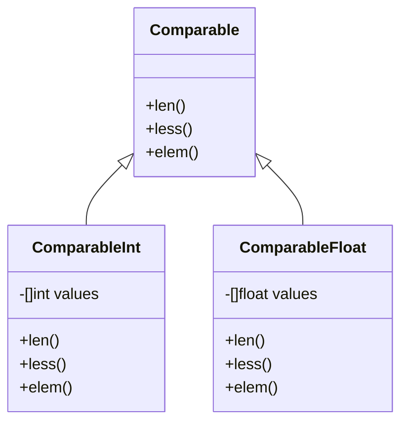
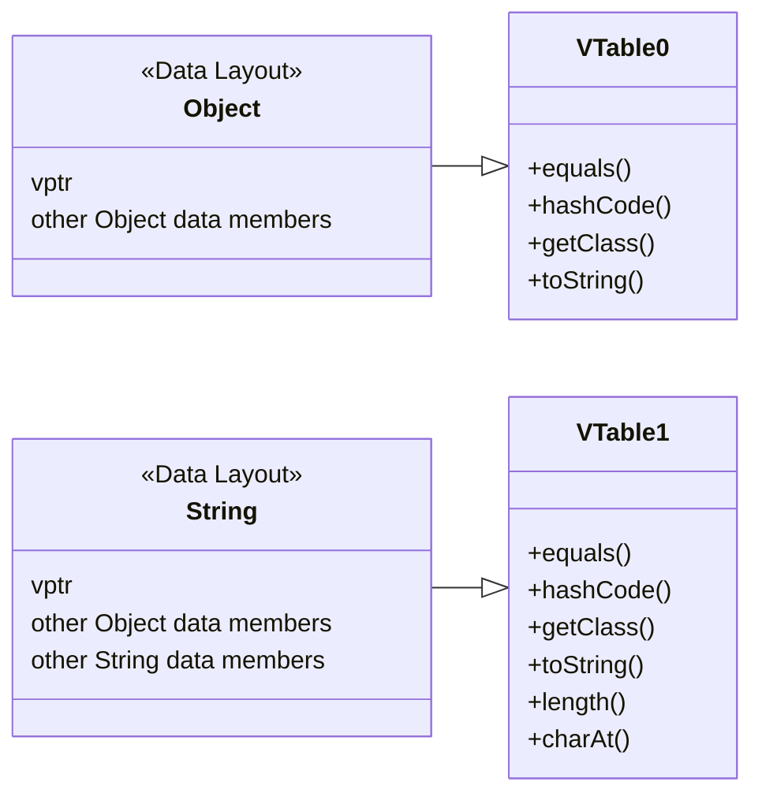
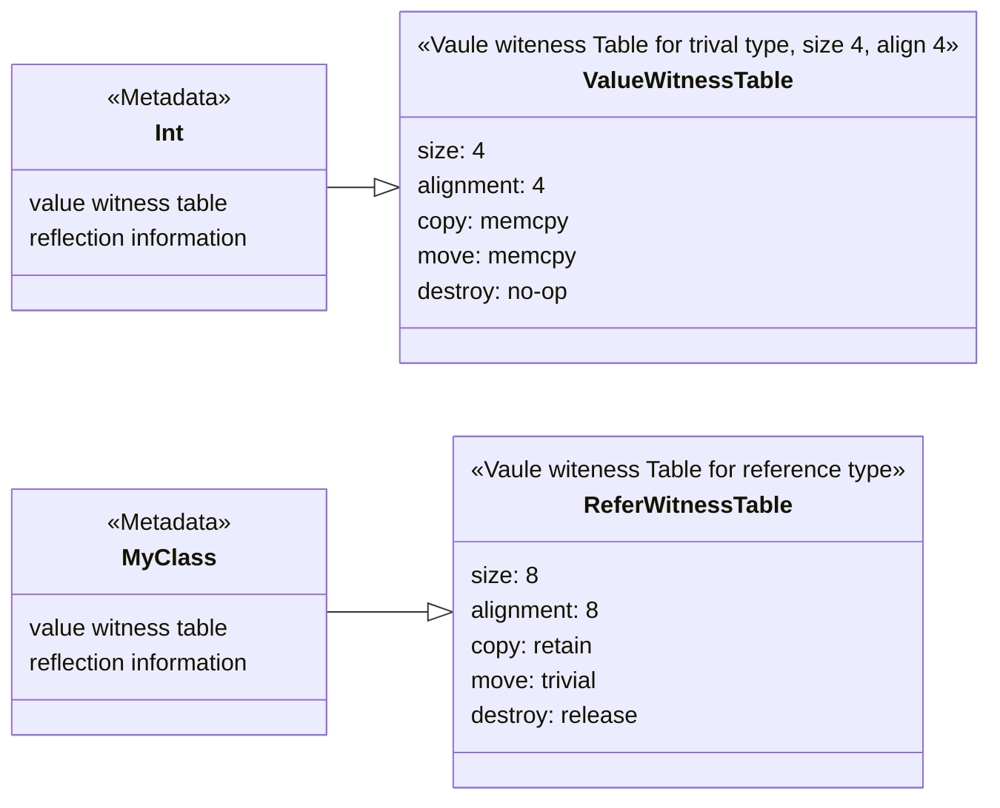

- [从Go引入泛型说起](#从go引入泛型说起)
- [什么是泛型](#什么是泛型)
  - [类型系统(Type system)](#类型系统type-system)
    - [类型内存布局(Type Memory Layout)](#类型内存布局type-memory-layout)
    - [类型检查](#类型检查)
  - [非泛型突破类型的限制](#非泛型突破类型的限制)
    - [手工复制(Manual code duplication)](#手工复制manual-code-duplication)
    - [代码生成(Code generation)](#代码生成code-generation)
    - [类型断言(Type assertation)](#类型断言type-assertation)
    - [反射(Reflection)](#反射reflection)
    - [接口(Interface)](#接口interface)
- [实现泛型](#实现泛型)
  - [装箱(Boxing)](#装箱boxing)
    - [类型擦除(Type-erased)](#类型擦除type-erased)
    - [虚函数表(Vtable)](#虚函数表vtable)
    - [字典(Dictionary)](#字典dictionary)
  - [单态化(Monomorphization)](#单态化monomorphization)
    - [代码生成(Code Generation)](#代码生成code-generation-1)
    - [模版(Template)](#模版template)
    - [蜡印(Stenciling)](#蜡印stenciling)
- [总结](#总结)
- [参考资料](#参考资料)

## 从Go引入泛型说起

<u title="2022/03/16">本月</u>，Go 1.18版本发布，一个大的变化是引入了正式的[泛型支持](https://go.googlesource.com/proposal/+/refs/heads/master/design/43651-type-parameters.md)。此时距离Go的第一次[泛型提案](https://go.googlesource.com/proposal/+/master/design/15292/2010-06-type-functions.md)已经过去了快<span class="heti-em">十二年</span>了！而花费如此长的时间引入的特性却引发了很多讨论与质疑。如在Reddit和Hacker News上这两个热门的帖子：

- [1.18 is released : golang](https://www.reddit.com/r/golang/comments/teu78z/118_is_released/)
- [Go 1.18 | Hacker News](https://news.ycombinator.com/item?id=30688208)

Go为什么要引入泛型？又为什么会花费如此长的时间？带着这个疑问让我们来看看编程语言中泛型的魔力吧。

## 什么是泛型

先看维基百科中对泛型编程（[Generic programming](https://en.wikipedia.org/wiki/Generic_programming)）的定义：

> Generic programming is a style of computer programming in which algorithms are written in terms of types to-be-specified-later that are then instantiated when needed for specific types provided as parameters. This approach permits writing common functions or types that differ only in the set of types on which they operate when used, thus reducing duplication.

如果上面这个非常学术化的定义让你无法理解的话，让我们先从一个简单的例子来说明泛型的作用。如下是个简单的C语言函数：

```c
int compare(int a, int b) {
    if (a < b) {
        return -1;
    } else if (a > b) {
        return 1;
    } else {
        return 0;
    }
}
```

这个函数的存在的问题是不灵活，如果调用方需要比较两个浮点数，那还需要编写一个浮点数的函数，这样就导致了很多仅有类型差异但实现重复的代码。

如果你写过JavaScript这种动态的编程语言就会发现根本不需要类型的约束。如下是JavaScript版本的算法：

```javascript
function compare(a, b) {
    if (a < b) {
        return -1;
    } else if (a > b) {
        return 1;
    } else {
        return 0;
    }
}
```

那么问题来了，为什么如C这种编程语言需要<span class="heti-em">显式</span>的类型约束呢？

### 类型系统([Type system](https://en.wikipedia.org/wiki/Type_system))

#### 类型内存布局(Type Memory Layout)

当应用的数据在内存中存储时，操作系统看到的只是一串比特序列，数据类型就是给这串比特序列一定的意义。比如有显式类型含义的编程语言中如C中的`int8`就会把比如`11111111`这串比特序列看作十进制的`127`，而`uint8`就会把这串比特序列看作十进制的`255`。显然同一串内存比特序列的含义因类型而异。这样就可以理解为什么C语言中的compare函数只能处理`int`而无法处理`long`了，因为编译成机器指令的代码只能处理`int`类型的数据。

在JavaScript中`Number`的内存大小是8个字节，而`String`的内存大小是16个字节，但只是一个指针引用，具体的内容大小是不确定的。

但JavaScript的函数为何可以处理多种类型的数据呢？这是因为JavaScript是一个`弱类型`的`动态类型检查`编程语言，而C却是一个`弱类型`</u>的`静态类型检查`编程语言。

#### 类型检查

- 强弱类型：如果一个编程语言有着严格的类型检查限制，那么可以说其是一个强类型的编程语言，反之则为弱类型。强类型的编程语言可以在类型不匹配时发生错误（编译与运行时都可能发生），而弱类型的语言在类型不匹配时会做隐式的类型转换，这会导致无法预料的运行时错误。强类型的拥护者认为严格类型检查可以带来类型安全、内存安全的好处，这方面的极致就是Rust为首的语言，而弱类型的拥护者认为过分夸大了类型和内存不安全带来的缺陷。
- 静动检查：<q>动态类型一时爽，重构代码火葬场</q>。开发过大型项目的人一定会对这句话深有体会。动态与静态的区别在于类型检查发生的阶段，动态是在运行时阶段，静态是在编译阶段。但实际上一些编程语言是混合的类型检查，比如在C#中开发者可以通过关键字来标识此数据类型检查是动态还是静态的。不少静态类型检查的编程语言也有动态的类型检查，比如Java中既有编译阶段的静态类型检查，又有运行时的动态类型检查（如父类与子类的<u title="Downcasting与Liskov Substitution principle">互相转换</u>）。
- 类型推导：一些编程语言虽然不需要开发者显示定义数据类型，但编译器能够做类型推导，帮助开发者定义数据类型，如Scala与Kotlin。

```markmap
# 类型检查
## 强类型
- C#
- Java
- Swift
- Rust
- Elixir
- Clojure
- Go
- Python
- Ruby
## 弱类型
- C
- C++
- PHP
- JavaScript
## 动态类型检查
- Elixir
- Clojure
- Python
- Ruby
- JavaScript
- PHP
## 静态类型检查
- C
- C++
- C#
- Scala
- Java
- Rust
- Swift
- Go
```

现在再回到起初的那个问题上，我们可以看到C与JavaScript同为`弱类型`的编程语言，真正的区别在于`动态类型检查`上。这让JavaScript的函数可以不受类型检查的限制，而C却受到了编译阶段的类型检查。

以Go语言为例，类型检查发生在编译阶段，如下：


> 思考一个问题：对一个强类型的编程语言来说，类型检查发生在编译阶段还是运行时分别有哪些<u title="我的理解是编译阶段会导致编译时间过长，而运行时会导致其运行性能变差">差异</u>？

### 非泛型突破类型的限制

由于类型检查对静态类型检查编程语言的限制，导致我们在实现一些算法时，由于这些算法对不同数据类型有着相同的处理流程，如果我们要实现一套针对所有类型都有效的算法库，就需要编写大量的重复代码。

在编程语言没有泛型特性的黑暗年代，存在这么一些古老的方法来解决对泛型的需求。

#### 手工复制(Manual code duplication)

任何语言都可以通过这种最简单的方式手动实现泛型的效果，除了对程序员很不友好之外，这种方法有以下一些优点：

- 产生的重复代码相比自动生成的代码要少。
- 相比运行时的方法性能要高。因直接调用函数开销比通过运行时做额外的类型检查要低。

#### 代码生成(Code generation)

Java的[ASM](https://asm.ow2.io/)与Go的[genny](https://github.com/cheekybits/genny)都可以做到自动代码生成，其他语言也都可以实现类似的功能。这种方法解放了程序员，虽然有以下的一些问题：

- 需要一些集成的手段去使用这些库，可能让代码构建变的更复杂。
- 增加了编译时间。
- 增加了二进制包的体积。

#### 类型断言(Type assertation)

这种方法通过将函数中的参数类型转换为<u title="或Any类型">根</u>类型（如Java中的`Object`或Go中的`interface{}`)，然后对根类型进行期望的类型断言。实现可参考Go的[类型断言示例代码](https://go.dev/play/p/ztlqzkbLTUt)。

这种方法有以下一些问题：

- 调用方需要将参数包装或转换成根类型。
- 实现方代码中耦合了大量的类型断言代码。
- 失去了编译器的类型安全保障。

#### 反射(Reflection)

与类型断言类似，不过是用反射的技术在运行时获取类型信息，通过对类型的枚举判断来实现。实现可参考Go的[反射示例代码](https://go.dev/play/p/Zf1W_t_-WHI)。

这种方法有以下一些问题：

- 可读性可能不太好，因为用到了复杂的反射技术。
- 会导致运行时性能差。运行时反射要比直接的代码多了很多指令操作，所以性能要慢很多。
- 失去了编译器的类型安全保障。

#### 接口(Interface)

[SOLID](https://en.wikipedia.org/wiki/SOLID)设计模式中的依赖倒置原则（Dependency Inversion Principle）要求软件接口在设计中应该依赖抽象而不是具体。比如在Java中方法参数可以设计成一个`interface`，之后可以针对此接口进行不同的实现，这样的设计也更容易写出可测试的代码。

根据这个指导原则，我们也可以用此实现泛型。



这样在我们的泛型方法里只需要依赖`Comparable`接口，调用方可以传入具体的类型如`ComparableInt`或`ComparableFloat`。

这种方法有以下一些问题：

- 可能需要定义很多数据类型。

## 实现泛型

准确的说这里的实现泛型指的是在编译器及运行时的支持下，编程语言自动实现泛型的功能。由于这些实现方式和运行时的一个概念强相关，这里提前介绍下动态派发([Dynamic Dispatch](https://en.wikipedia.org/wiki/Dynamic_dispatch))的概念。

派发目的是让程序运行时知道被执行的函数或方法所在的内存位置。派发分为：

- 静态派发(Static dispatch/early binding)：当程序在编译时可以找到执行的函数。C++默认使用的是直接派发，加上`virtual`修饰符可以改成虚函数表(Vtable)派发。直接派发是最快的，原因是调用指令少，还可通过编译器进行内联等方式的优化。这种派发缺点是不灵活，无法实现一些面向对象所需的技术如多态性。
- 动态派发(dynamic dispatch/run-time dispatch/virtual method call/late binding)：当程序在运行时可以找到执行的函数。Java默认使用的是虚函数表(Vtable)派发，通过`final`修饰符可改成直接派发。虚函数表派发是有动态性的，一个类里会用表来存储类成员函数的指针，子类重写(Override)父类的函数会替代父类的函数，子类添加的函数会被加到这个表里。当程序运行时派发时会从这个表中找到对应的函数，这样就可以实现动态派发。面向对象的编程语言正是靠此机制实现了多态性(Polymorphic)。
- 消息机制(message passing)：通过消息传递来调用被执行的函数。这种机制是在运行时可以改变函数的行为，甚至函数可以未实现，也不会引发运行时错误。比如Objective-C中就是通过消息传递来调用被执行的函数，甚至可以在程序运行过程中实现热更新代码。

以上三种派发方式都有其优劣：比如静态派发的速度是最快的，但并不灵活。而动态派发虽然比较慢，但却可以实现面向对象多态的功能。消息机制是最灵活的方式，但性能也最差。

前面我们已经看了手工实现泛型的多种方式。为了解放程序员，各静态类型检查的编程语言都实现了泛型，走的路线却各不相同。如下图：

```markmap
# 实现泛型的方式
## 装箱(Boxing)
### 类型擦除(Type-erased) `Java`
### 虚函数表(Vtable)
#### Embedded vtable `Java`
### 字典传递(Dictionary passing)
#### `Go`
#### Witness table `Swift`
## 单态化(Monomorphization)
### 代码生成(Code Generation) `C`
### 模版(Template) `C++`
### 蜡印(Stenciling)
#### GC Shape Stenciling `Go`
```

大致来说编译器实现泛型的两种方式是装箱(Boxing)和单态化(Monomorphization)。

### 装箱(Boxing)

装箱的思路是将所有类型包装成统一的类型，有了统一的类型就有了统一的内存模型，这样函数在调用时传递的是统一的数据类型，也就不会出现类型不匹配的问题。这种思路我们在手工实现的方式里就用到了，比如[类型断言(Type assertation)](#类型断言type-assertation)、[反射(Reflection)](#反射reflection)与[接口(Interface)](#接口interface)的实现。

#### 类型擦除(Type-erased)

对Java来说统一的数据类型就是Object，在编译阶段做完类型检查后就将类型信息通过转换成Object进行擦除，这样只需要生成一份泛型函数的副本即可。类型擦除保证了泛型函数生成的字节码和非泛型函数的是相同的，也符合Java对<u title="这对Java生态来说很重要，旧的代码不需要迁移即可调用新的泛型库。但也让这个泛型的能力和其他语言相比差了很多，有很多限制（如不支持基本类型）。">兼容性</u>的要求。不过类型擦除也给Java的泛型带来了很多的[限制](https://en.wikipedia.org/wiki/Generics_in_Java#Problems_with_type_erasure)。

#### 虚函数表(Vtable)

之前在动态派发中介绍了虚函数表，对Java来说通过类型擦除结合虚函数表就实现了泛型的效果：运行时同样的数据类型`Object`，却能调用原始类型的方法。



#### 字典(Dictionary)

编译器在编译泛型函数时只生成了一份函数副本，通过新增一个字典参数来供调用方传递类型参数(Type Parameters)，这种实现方式称为字典传递(Dictionary passing)。

还记得Go泛型的正式名称叫什么吗？类型参数(Type Parameters)！这也暗示了Go实现泛型的方式，那就是在编译阶段，通过将类型信息以字典的方式传递给泛型函数。当然这个字典不仅包含了类型信息，还包含了此类型的内存操作函数如`make/len/new`等。

同样的Swift也通过字典传递了一种名为`Witness table`的数据结构，这种数据结构包含着类型的大小及类型的内存操作函数（移动、复制与释放）。如下图：



Swift在编译阶段通过在函数入参中以字典的形式把`Witness table`注入，达到了以统一的方式处理任何类型，而不用对类型进行装箱操作。这样一来，Swift就可以实现泛型，而且不需要单态化，虽然在运行时有动态查找的开销，但这种表结构节省了分配内存和缓存不一致性的成本。

```swift
func getSecond<T>(_ pair: Pair<T>) -> T { 
  return pair.second 
}

//上述函数编译后变成下面的函数，入参的T就是Witness table的数据结构

void getSecond(opaque *result, opaque *pair, type *T) { 
  type *PairOfT = get_generic_metadata(&Pair_pattern, T); 
  const opaque *second = (pair + PairOfT->fields[1]); 
  T->vwt->copy_init(result, second, T); 
  PairOfT->vwt->destroy(pair, PairOfT); 
}
```

### 单态化(Monomorphization)

单态化的思路是自动生成多个类型的泛型函数版本，看起来就是一个模版代码生成的过程，但是也需要考虑很多种情况。比如：

- 生成所有类型的函数版本：这种最简单，但是会拖慢编译时间，也会让最终的二进制文件变得很庞大。
- 生成调用类型的函数版本：这种需要编译器分阶段或多次编译，比如需要遍历寻找调用点来确定最终的类型列表，对于不同包的同名函数的处理等。
- 是否支持独立编译：如果调用泛型函数的类型与泛型函数不在同一个包内，是否能支持泛型函数独立的编译。

#### 代码生成(Code Generation)

这种技术是编译器不支持泛型时可采用的最简单的方案，比如C语言的宏就可以实现代码生成泛型函数的功能。不过这种技术实现的泛型有很多边界问题和限制，只有在编程语言不支持泛型特性的情况下才会使用。

#### 模版(Template)

C++通过模板实现泛型类、方法和函数，这导致编译器为每个唯一的类型参数集编译了代码的单独副本。这种方法的一个关键优势是没有运行时性能开销，尽管它以增加二进制文件大小和编译时间为代价。

#### 蜡印(Stenciling)

蜡印其实就是模版，也是一种代码生成技术。但Go除了使用字典传递实现装箱外，还采用了`GC Shape Stenciling`的技术。这种看起来很高级的名词简单来说是为了解决蜡印或模版的问题，因为在蜡印的过程中，编译器会为每一个实例化的类型参数生成一套独立的代码，这种会有一个问题，请看下面的例子：

```go
type a int
type b int
```

虽然`a`和`b`是两个自定义的类型，但它们底层都是`int`类型，但编译器会为这两个类型而生成两套函数的版本（如对`max`泛型函数来说会生成`max_a`与`max_b`两个函数版本）。这是一种浪费，还会生成庞大的二进制文件。`GC Shape`这种技术就是通过对类型的底层内存布局（从内存分配器或垃圾回收器的视角）分组，对拥有相同的类型内存布局的类型参数进行蜡印，这样就可以避免生成大量重复的代码。

Go实现泛型的方式混合了字典与蜡印技术，最终的流程如下：


> 思考题：为什么Swift采用了和Go类似的字典装箱技术，却并没有混合使用蜡印技术？

总的来说Go在1.18实现泛型的方式和Rust挺类似的，如果感兴趣可以看这篇Rust泛型的文章：

- [透过 Rust 探索系统的本原：泛型](https://mp.weixin.qq.com/s/SJsEurfZr4TG-I3rncid5A)

## 总结

对静态类型检查的编程语言，实现泛型的方式有很多，如：

- C：通过**宏定义**来实现，简单方案却能满足大部分需求，还有着不错的性能。
- C++：通过**模版**实现，相比C的宏，模版显然更强大灵活。
- Java：通过**类型擦除的装箱技术结合虚函数表**实现，虽然类型擦除导致Java的泛型实现不如人意，但这种代价确保了兼容性。
- Swift：通过**字典传入的方式配合Witness table**的实现，这种巧妙的方式在编译速度与运行时速度之间取得了不错的平衡。
- Go：通过**字典传入的方式配合GC Shape的蜡印技术**实现，这种方式在编译速度与运行时速度之间取得了不错的平衡。

总的来说泛型是个和编译技术强相关的概念，由于本文涉及了多种编程语言，文中可能存在一些因笔者能力有限而导致的错误，欢迎读者指正。同时一些编程语言如Go也在不断的改进自己实现泛型的机制，所以此文也会存在一些时效性的问题。

我希望能通过这篇文章帮助读者更好的理解泛型，尤其是多种编程语言的实现机制，以及语言设计者在泛型设计上的一些权衡利弊的考虑，这样也能有助于我们了解自己日常使用的编程语言，写出更好的代码。

## 参考资料

- [Models of Generics and Metaprogramming: Go, Rust, Swift, D and More - Tristan Hume](https://thume.ca/2019/07/14/a-tour-of-metaprogramming-models-for-generics/)
- [Comparing the implementation of generics | Thomas Denney](https://www.thomasdenney.co.uk/blog/2016/11/13/comparing-the-implementation-of-generics/)
- [2017 LLVM Developers’ Meeting: “Implementing Swift Generics ”](https://youtu.be/ctS8FzqcRug)
- [proposal/generics-implementation-dictionaries-go1.18.md at master · golang/proposal](https://github.com/golang/proposal/blob/master/design/generics-implementation-dictionaries-go1.18.md)
- [Go 1.18 type parameters | Let's Go generics](https://youtu.be/Rvq__lVVmQc)
- [Golang Generics Implementation Details - njkhanh](https://njkhanh.com/golang-generics-implementation-details-p5f3138353534)
- [Dynamic vs. Static Dispatch | Lukas Atkinson](https://lukasatkinson.de/2016/dynamic-vs-static-dispatch/)
- [Go语言设计与实现（@Draven）](https://book.douban.com/subject/35635836/)
- [Go泛型是怎么实现的?](https://colobu.com/2021/08/30/how-is-go-generic-implemented/)
- [Swift - 派发机制](https://www.cnblogs.com/baitongtong/p/14762857.html)