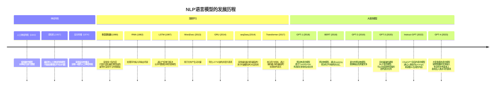
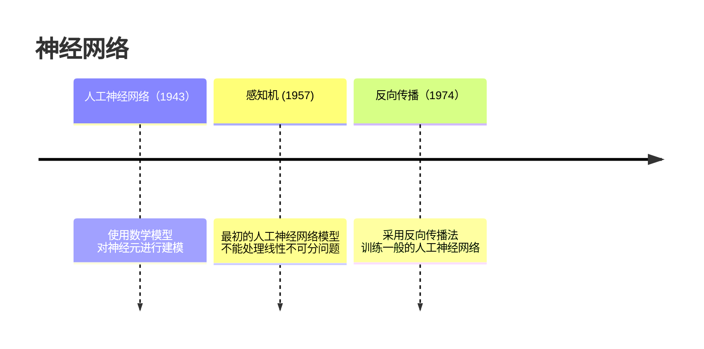
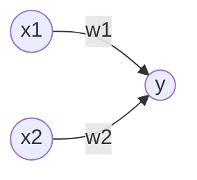
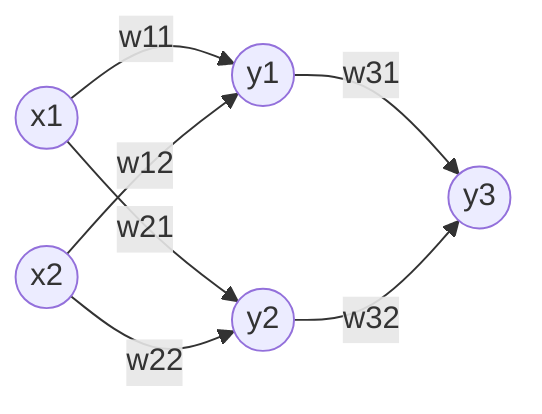
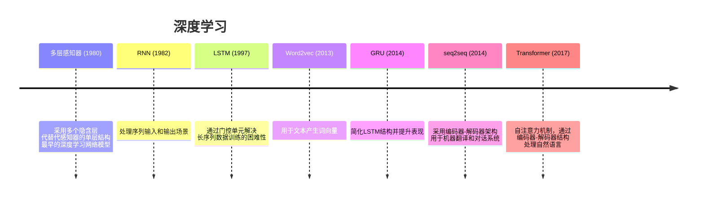
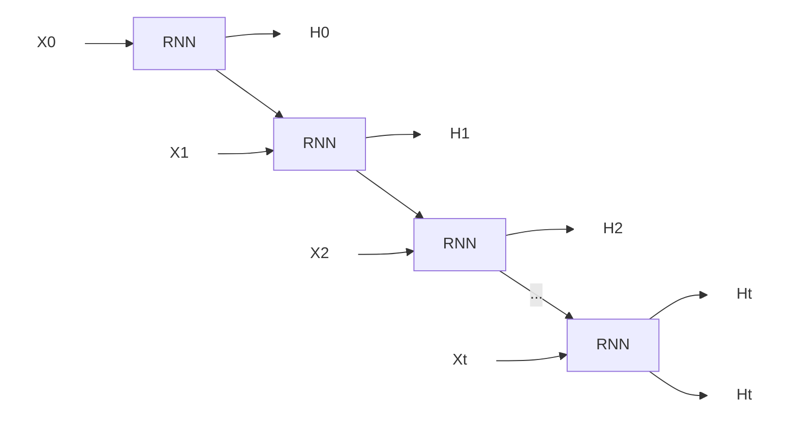
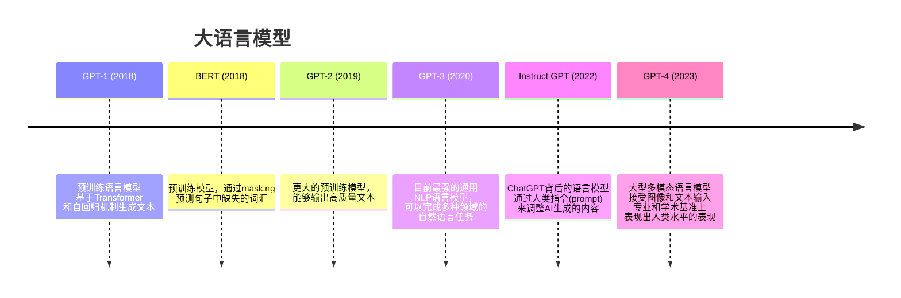

{}
<strong>本文修订记录</strong> 
2023/05/08 感谢<a href="https://imzhanghao.com/">张浩在路上</a>对本文的审阅和修改； 
2023/05/07 与ChatGPT合作完成初稿； 
2023/04/22 选题与大纲设计；
{}

- [自然语言](#自然语言)
  - [人类文明的高科技](#人类文明的高科技)
  - [人工智能的一颗明珠](#人工智能的一颗明珠)
- [从神经网络到深度学习](#从神经网络到深度学习)
  - [神经网络](#神经网络)
  - [深度学习](#深度学习)
    - [从文本到词向量](#从文本到词向量)
    - [循环处理文本序列](#循环处理文本序列)
    - [从序列到序列](#从序列到序列)
    - [注意力是全部](#注意力是全部)
- [大语言模型时代](#大语言模型时代)
  - [生成式预训练](#生成式预训练)
  - [大力出奇迹](#大力出奇迹)
- [未来展望](#未来展望)
- [进阶阅读](#进阶阅读)

ChatGPT的火爆出圈，让大家对自然语言处理（Natural Language Processing）语言模型的发展历程产生了浓厚的兴趣。本文将从深度学习在NLP领域的发展历程，到大语言模型的发展历程，再到大语言模型的未来展望，带你一起了解NLP语言模型的发展历史。

## 自然语言

想必很多人对ChatGPT涌现出的多领域能力感到震撼，尤其是它能很好使用人类的语言与人类沟通，光这一点就已经足以让很多人感到恐怖了。机器会使用自然语言与我们沟通，为什么会让我们感觉到恐怖？

想象一下，某天我们的宠物突然会说话，会不会让我们感到难以接受？这是因为从数万年前我们的祖先智人走出非洲并统领地球开始，我们就一直是地球上唯一会使用语言的物种，这是我们与其他物种的巨大差异，也是我们独特的优势所在。但现在这种优势被我们创造出的智能掌握了，这是我们感到恐怖的原因。

### 人类文明的高科技

人类从掌握语言，并以语言创造出文字，靠着这种超越其他物种的能力，人类从个体的单打独斗产生了复杂的协作关系，从而进入文明社会，这意味着我们靠语言与文字创造了可延续的文明。

现代经济、国家、法律、文化等都是人类集体共同想象的产物，这是智人与其他物种一个巨大的差异，而语言又是想象的载体，正是有了语言，我们才能够将想象力传递给其他人，从而创造出璀璨的人类文明。

从这个角度看，语言是人类最先掌握的高科技，也是人类文明存在的基础。

### 人工智能的一颗明珠

在人工智能发展之前，人类是地球上甚至宇宙中唯一拥有智慧的生物，但我们的智慧只能通过繁衍后代的方式传递给下一代，老实说这种方式太过低效。在人类发明计算机后，人类智慧从碳基生物传递给硅基生物成为了可能。

于是人工智能诞生了，人工智能是一门研究如何使机器能够像人一样智能的学科，这也是人类探索自身智慧的一门学科。

如何让机器拥有类人一样的智慧？第一步就是让机器能够理解人类的语言，这样机器才能够通过语言学习人类文明的知识，能与人类进行沟通，这也是人工智能领域的一个重要分支，这个分支被称为自然语言处理（Natural Language Processing，简称NLP），它是人工智能领域的一颗明珠。

如果机器能理解人类的语言，配合计算机视觉（Computer Vision），再给这个系统一套机器人的机械身体，那人类相当于可以像神一样创造新物种了。照这个方向继续发展，<q>机械飞升</q>也不是不可能。

而现在，我们创造出的智能也掌握了人类自然语言，这也许是我们进入智能文明的标志。

## 从神经网络到深度学习

要让机器能够理解人类语言，目前常用的方法是从机器学习开始。传统的机器学习方法有先天假定，需要人工确定数据特征（即特征工程），这可能需要大量的人工工作，并且存在错误假设的可能性。

在机器学习领域中，深度学习是一种基于神经网络的机器学习技术。其中的主要特点是能够自动学习数据的特征，通过将特征学习任务交给模型进行训练来实现自动学习过程。

> 机器学习一开始有很多路线，不过逐渐人们发现深度学习的效果非常好，很多机器学习领域要解决的问题都可以用深度学习解决。

### 神经网络

神经网络是一种模拟人脑神经元网络的机器学习模型，它最早于1943年被提出，它使用数学模型对神经元进行建模，神经元是人脑的基本单元，它接收输入信号，经过处理后产生输出信号，神经元之间通过突触连接，突触可以增强或抑制神经元之间的连接强度。

最简单的感知器模型如下所示：

如果用数学公式来表达如下所示：

$$ y=\begin{cases} 0 & w_1x_1+w_2x_2\leq \theta \\\ 1 & w_1x_1+w_2x_2>\theta \end{cases} $$

看起来不可思议，人类的智慧竟然可以用这么简单的公式来表达。这个公式的意思是，如果输入的两个信号的加权和大于阈值，那么输出1，否则输出0。这个公式就是感知器的数学模型，它是最早的神经网络模型。

单个的神经元很简单，但通过多个神经元的组合，就可以构成复杂的神经网络，这样的神经网络就可以解决复杂的问题。如下图所示是一个简单的神经网络：

如何理解这个神经网络呢？首先，这个神经网络有3层，第一层是输入层，第二层是隐含层，第三层是输出层。输入层有两个神经元，隐含层有两个神经元，输出层有一个神经元。每个神经元都有一个阈值，每个连接线都有一个权重，这些权重和阈值都是需要训练的参数。

这个简单的神经网络通过叠加多个隐含层，就可以完成复杂的人工智能任务，比如识别图片中的手写数字，这个流程如下：

1. 第一层输入层接收图片的像素点作为输入信号，比如图片的大小是28x28，那么输入层就有784个神经元；
2. 隐含层将输入信号进行处理，层层传递后给输出层产生信号；
3. 输出层的信号就是图片的内容，比如输出层有10个神经元，那么输出层的信号就是10个数字，每个数字代表图片识别的概率，概率最大就代表整个神经网络的识别结果。

这个流程看起来很简单，但是神经网络的训练过程非常复杂，需要大量的数据和计算资源，所以在神经网络被提出后，很长一段时间没有得到应用。而且为了取得好的效果，神经网络的层数就需要很多，深度学习就是指神经网络的层数很多，所以深度学习的训练过程更加复杂。

### 深度学习

深度学习就是加深神经网络的层数，当然在特定领域的处理中，除了加深层数还需要处理特定的问题，比如在自然语言处理领域，就需要处理文本的序列问题，这个时候就需要采用RNN、LSTM、GRU、seq2seq、Transformer等模型。

这些模型并不是独立的，而是相互关联的，比如seq2seq模型就是由RNN和LSTM组成的，Transformer模型就是由seq2seq模型演变而来的。

和大家也许想的不同，当ChatGPT与人交流时，它会根据上下文不断预测并生成下一个单词。这个上下文包括了之前生成的所有单词，而不是一次性生成整个句子。我们可以通过如下数学公式来表示这个过程：

$$ P(w_1,w_2,...,w_n)=\prod_{i=1}^nP(w_i|w_1,w_2,...,w_{i-1}) $$

该公式表示生成整个句子$w_1,w_2,\ldots,w_n$的概率等于每个单词的生成概率之积（联合概率），其中每个单词的概率都是基于其前面所有单词来计算的。以上公式能给出单词序列发生的概率，这意味着语言模型可以通过概率来评估一个单词序列发生的可能性，也意味着可通过此概率评估一个句子在多大程度上是自然的单词序列。通过这种概率的计算，让ChatGPT这类语言模型能够产生连贯而自然的对话回复。

#### 从文本到词向量

从上面神经网络的例子中，我们可以看到神经网络的输入和输出都是数字，而且神经网络的每个神经元都是一个数字，这些数字都是浮点数，所以神经网络的输入和输出都是浮点数。

但自然语言处理的输入输出都是文本，所以需要将文本转换为数字，这个过程就是文本的向量化，也就是将文本转换为向量。文本向量化的方法有很多，比如one-hot、TF-IDF、word2vec等。

word2vec是一种用于生成词向量的神经网络模型，它最早于2013年被提出。该模型主要用于自然语言处理任务中，如文本分类、文本生成等。相比于one-hot和TF-IDF，word2vec可以将文本中的每个单词转换为一个固定长度的向量，这个向量可以用于神经网络的输入。

有趣的是，词向量表示只是word2vec模型的副产品，word2vec模型的主要目的是通过训练神经网络来学习词向量，而不是生成词向量。word2vec模型通过训练神经网络来预测输入文本序列中下一个单词，当模型训练的能成功预测下一个单词时，说明神经网络已经学习到了文本中单词的语义信息，这个时候神经网络的隐含层（输入权重）就是输入文本序列的词向量，这也意味着在不同的语料库中，相同单词的词向量是不同的，但是相似的单词的词向量是相似的。

#### 循环处理文本序列

将文本转换为词向量后，另一个问题是目前神经网络都是前馈神经网络，它们都是将输入数据从输入层传递到输出层，而没有反馈，所以无法处理序列数据，比如文本序列。于是就有了循环神经网络（RNN）。

RNN模型指的是循环神经网络（Recurrent Neural Network），它最早于1982年被提出。该模型主要用于自然语言处理任务中，如文本分类、文本生成等。循环神经网络通过使用循环结构，将当前时刻的输出作为下一时刻的输入，从而实现对序列数据的处理。

循环神经网络的每个神经元都有两个输入，一个是当前时刻的输入，一个是上一时刻的输出，这样就可以将序列数据的信息传递到下一时刻。循环神经网络的结构如下图所示：

如上图所示，循环神经网络可以从输入序列$X$中逐个读取输入$X_t$，并将当前时刻的输入$X_t$和上一时刻的输出$H_{t-1}$作为输入，然后输出当前时刻的输出$H_t$，这样就可以将序列数据的信息传递到下一时刻。

不过原始的RNN模型存在记忆消失的问题，在长序列的情况下，模型无法学习到序列中较早的信息（可以简单理解为RNN在输入序列的循环过程中，在每次的输入转换中有信息的损失），所以后来又有了LSTM和GRU模型，这些模型通过使用门控结构（输入门、遗忘门与输出门），解决了RNN的记忆问题。

> 神经网络模型经常使用反向传播和梯度下降算法进行训练，以便更新模型参数来获得更接近真实值的输出结果。然而，由于存在梯度消失和梯度爆炸的问题，导致模型无法正确训练和收敛。在RNN模型中，这些问题尤为突出。
>
> 梯度消失是指在反向传播过程中，梯度值逐渐减小，最终使得模型无法训练。与之相对，梯度爆炸是指反向传播中梯度值变得极大，同样也会导致模型无法训练。了解这些问题后，我们需要寻找一些方法来解决它们。例如，可以通过采用梯度裁剪技术来解决梯度爆炸的问题；使用LSTM等网络结构可以有效缓解梯度消失的问题。此外，ReLU激活函数也被广泛使用，因为它能够防止梯度消失并加快训练速度。

#### 从序列到序列

有了RNN模型，就可以处理序列数据了，但是RNN模型只能处理单个序列，而不能处理两个序列之间的关系，于是就有了seq2seq模型。

seq2seq模型指的是序列到序列模型（Sequence-to-Sequence Model），它最早于2014年被提出。该模型主要用于自然语言处理任务中，如机器翻译、对话系统等。

在传统的机器翻译方法中，通常采用基于短语或句法分析的方法将源语言句子转化为目标语言句子。这种方法存在大量的人工特征工程和规则定义，效果依赖于语言专家和领域知识，难以适应不同的语言和领域。

seq2seq模型通过使用编码器-解码器架构，将两个序列之间的关系转化为两个向量之间的关系，从而实现对两个序列之间的关系进行建模。在不需要手工特征工程的情况下，自动地学习源语言到目标语言之间的映射关系。其中，编码器将源语言序列映射到一个固定长度的向量表示，解码器利用这个向量表示生成目标语言序列。这种端到端的训练方式具有很强的可扩展性和泛化能力，并且随着数据量的增加，模型表现也会逐渐提升。

因此，seq2seq模型既解决了传统机器翻译方法中需要注重规则和特征工程的缺陷，同时也支持了更加复杂和灵活的自然语言处理任务。

它的架构如下所示：

如上图所示，这是一个翻译汉语到英文的语言任务，输入的是汉语句子<q>你好</q>，输出的是英文句子<q>Hello</q>。首先，将输入的汉语句子经过编码器，得到一个固定长度的向量表示，然后将这个向量表示输入给解码器，解码器将这个向量表示转化为英文句子。

以下是Seq2Seq模型在生成文本时的训练与生成流程：

1. 输入数据预处理

  首先，需要将输入的原始文本经过分词、去除停用词等预处理步骤，并将其转化为词向量表示，得到输入序列$X=(x_1, x_2, ..., x_T)$。

2. 编码器

  将输入序列$X$输入给编码器（Encoder），编码器使用RNN（通常采用LSTM或GRU）将词向量序列转化为单个上下文向量$z$，即最后一个时间步的隐藏状态。这个向量包含所有输入信息的综合表示，它将被用于之后的解码器中。

3. 解码器

  解码器（Decoder）通过读取上下文向量 $z$，并且使用另一个RNN来生成输出序列$Y = (y_1, y_2, ..., y_{T'})$。这里的输出序列长度不一定和输入序列相同。例如，在翻译中，从英语到意大利语的句子长度可能会改变。

4. 训练

  对于每个目标输出序列$Y'$（即参考答案），训练的目的是尽可能地使生成的输出序列$Y$最大程度地接近$Y'$。因此，我们需要定义一个损失函数，用来衡量以$Y$作为输出时产生的误差，通常使用交叉熵损失函数。

5. 生成

  在生成时，我们使用训练好的编码器和解码器来处理新的输入，并生成一个输出序列。具体地，首先将输入字符串经过相同的预处理转化为词向量序列$X$。然后，将$X$拿去给编码器，得到上下文向量$z$。最后，利用解码器对$z$进行解码，即可得到生成的输出序列$Y$。

seq2seq模型的优点是可以处理变长的序列，但是它也存在一些缺点：

1. 编码器只能通过一个固定长度的向量来表示输入序列，这个向量包含了输入序列的所有信息。因此，编码器的向量表示可能会存在信息损失，这会影响到解码器的性能。
2. 编码器和解码器都是使用RNN来实现的，因此它们都存在梯度消失和梯度爆炸的问题。这会导致模型的训练变得困难，同时也会影响到模型的性能。
3. 编码器和解码器都是使用RNN来实现的，因此它们都是串行的结构，无法并行计算，导致训练速度较慢。

seq2seq模型的缺点主要是由于RNN的缺点导致的，因此我们需要一种新的模型来解决这些问题，这就是Transformer模型。

#### 注意力是全部

RNN网络模型的问题主要在于，串行处理输入序列，无法并行计算，同时也无法捕捉到输入序列中的长距离依赖关系。而Transformer模型则是完全基于注意力机制来实现的，因此它不仅能够并行计算，而且能够更好地捕捉输入序列的长距离依赖关系，从而提升模型的性能。

在RNN中，序列中的每个单元都是按顺序依次进行计算的，后一个单元的计算需要等待前一个单元计算完成后才能开始，因此无法并行化计算。而在 Transformer 中，自注意力机制的计算可以并行计算，因为每个单词的表示向量是独立计算的，它们的计算不需要等待其它单词的计算完成，因此可以同时进行。此外，注意力权重的计算也可以并行化，因为每个单词与其它单词的相似度可以同时计算，因此 Transformer 的自注意力机制可以更快地处理大规模序列数据。

对比RNN，举例来解释Transformer的注意力机制：

假设我们有一组输入序列，包含5个单词："I", "like", "to", "eat", "pizza"。

1. 我们将每个单词转化为向量表示。可以使用词向量来表示每个单词。
2. 将每个单词向量应用于三个全连接层，以获得表示向量。每个全连接层都采用不同的权重矩阵，用于捕捉不同方面的单词特征。
3. 为了计算向量之间的相似性，我们将每个表示向量与相邻单词的表示向量计算点积。对于句子中的每个单词，它将与前后单词的表示向量进行点积。
4. 我们将每组点积值传递到 Softmax 函数中，以得出每个单词与相邻单词的注意力权重。这个步骤计算了每个单词与相邻单词的重要性，并为序列中的每个单词分配了注意力权重。
5. 将每个单词向量与其对应的注意力权重相乘，然后将它们相加。这将形成一个自注意力池化向量，该向量是所有输入单词的加权和。这个自注意力池化向量可以更好地捕捉单词之间的语义关系，同时维护整个输入序列的完整性。

通过这种方式，自注意力机制允许模型更加全面地考虑输入序列中不同单词之间的关系，并获取单词之间的上下文信息，从而为序列到序列转换任务提供更好的表现力和准确性。

Transformer模型的架构如下所示：



如上图所示，Transformer模型的编码器和解码器都使用了自注意力机制，它们的输入都是整个序列，而不会像RNN那样串行处理序列。因此，Transformer模型可以并行计算，从而提升模型的训练速度。

Transformer模型将语言模型的训练带入了大语言模型时代，因为它的训练计算复杂度不会随着输入序列的长度而指数增加，因此可以训练更大的模型，从而提升模型的性能。

同时随着GPU计算能力的提升，Transformer模型的训练时间也大大缩短，因此Transformer模型的训练成本也大大降低，于是一个大语言模型的时代拉开了序幕。



## 大语言模型时代

在Transformer模型出现后，这种架构启发了OpenAI的研究人员，于是他们在2018年提出了GPT-1模型，这是一个基于Transformer的预训练语言模型，它使用了自回归机制来生成文本。

### 生成式预训练

Generative Pre-Training (GPT) 语言模型的训练过程是半监督的，使用了无监督预训练和有监督微调的组合方法，旨在学习一个通用的表征，以便在各种任务中进行迁移学习。

该模型使用Transformer架构右侧的解码器（Decoder）部分，在无标注数据上使用语言建模目标进行初始参数学习，然后使用相应的监督目标来适应目标任务（用有标注的数据训练并微调模型）。在转移过程中，使用从遍历式方法推导出的特定于任务的输入适应进行微调，以实现最小的对预训练模型架构的更改。该模型在自然语言推理、问答、语义相似性和文本分类等四个类型的语言理解任务上都获得了优异的表现。

GPT的创新之处在于：

- 通过Transformer架构，它实现了并行计算，提高了模型训练速度。同时，该架构还具备自回归机制，支持文本生成任务；
- 结合预训练和微调技术，GPT可以应用于多种NLP任务，并支持零样本学习；
- GPT不仅支持多模态、多语言、多任务和多领域任务，而且在这些领域中表现优异。

> GPT使用了Transformer模型的右侧解码器，因为其被证明是一种非常适合自然语言处理任务的模型，并且能够在处理长序列时表现出色。
>
> Transformer模型中有两个主要的组件：编码器和解码器。而编码器被设计用于从输入序列中提取信息，而解码器则可从该信息生成输出序列。 在机器翻译等任务中，需要将源语言序列（即输入）转换为目标语言序列（即输出）。因此，传统的神经机器翻译系统使用编码器-解码器架构来进行这些任务。
>
> 然而，在语言生成任务如文本生成、对话模型等方面，只需要根据历史上下文生成新的单词/字符串。 在这些任务中，只需要生成一个序列，而不是翻译两个不同语言之间的不同的序列信息。因此，使用Transformer模型中解码器部分的权重，可以更好地拟合文本生成类任务，同时也可以更好地利用它的多头自注意力机制和残差连接来处理长序列，并且可以解决学习时间步骤之间长距离依赖关系的挑战。

### 大力出奇迹

人类的大脑神经元数量大约是1000亿个，这些神经元能产生数万亿个连接，而GPT-1模型的参数数量只有1.17亿个，这意味着GPT-1模型的参数数量只有人类大脑神经元数量的0.1%。

不知道OpenAI是否受到了这个启发，于是他们在2019年提出了GPT-2模型，这是一个更大的预训练模型，它的参数数量是GPT-1模型的10倍，达到了15亿个，在2020年发布的GPT-3模型的参数数量是GPT-2模型的100倍，达到了1750亿个，从数量上来看，GPT-3模型的参数数量已经超过了人类大脑神经元的数量。

于是，奇迹出现了，GPT-3模型在专业和学术基准上表现出了人类水平的表现。这个奇迹的出现是因为GPT-3模型使用了深度学习和大规模预训练技术，它被训练了海量的自然语言数据，并利用自监督学习方法进行强化，使其能够产生惊人的语言表达能力。此外，GPT-3还具有令人难以置信的创造力，它能够生成准确、流畅的文章、诗歌和音乐，甚至在游戏、绘画等其他领域也能发挥出惊人的创作能力。

虽然GPT-3模型已经展示了令人瞩目的性能，但它仍然存在一些局限性，比如对于某些特定领域知识的理解还不够深入，同时语言模型的运行需要庞大的计算资源和存储空间，这也增加了该技术应用的成本。未来，我们可以期待更加智能、灵活、高效的语言模型的出现，它们将会给我们带来更多新的可能性和优秀的应用场景。

然而，GPT-3的强大并非仅凭借大力出奇迹而来，因为许多其他参数数量超过人类大脑神经元数量的[语言模型](https://briefgpt.xyz/lm)却没有表现出比GPT更好的效果。可见，GPT-3之所以拥有如此巨大的影响力，是由于其强大的表现和开创性的技术贡献所决定的。

## 未来展望

未来的一个可见的方向是把大语言模型当作推理引擎，无需编程即可完成各种用户提交的任务。比如当用户请求播报最近热点新闻简报的请求时，大语言模型可自动规划任务并使用必要的工具来完成任务：通过网络请求获取一些新闻网站的热点新闻RSS地址，然后自动爬取新闻的内容，之后总结新闻，并调用文字转语音接口合成语音。与传统的编程方式相比，这种方式更加灵活、高效。我们只需要设计一套内置的规则，大语言模型就会动态的规划完成任务需要的步骤及每个子任务的工具，这种方式可以大大降低人类的编程成本。

未来的研究方向之一将会是让机器学习模型在只有少量数据输入和能量消耗的情况下能够像人脑一样进行新知识的学习。尽管深度学习在自然语言处理领域的进展已经非常显著，但我们仍需寻找更高效、节能的方法来应对大规模的学习任务。为了降低成本，未来的人工智能发展可能需要从更深层次上改变算法和计算架构，在保证高效性的同时实现更低的能耗。

另一个重要的趋势是尝试统一语言理解和语音、图片、视频等多模态内容。Transformer模型在这个方面已经起到至关重要的作用，并使得GPT-4拥有了多模态的能力。未来的研究将集中在设计更加灵活、适应性更强的模型，使其能够跨越不同类型的内容和媒体形式。

泛化及可解释性问题也是未来研究的重要方向。随着技术的不断进步，我们期望机器能够像人类一样具备广泛的推理和应用能力，同时也能够给出解释和原因，以便更好地理解机器的决策和思维过程。

同时，安全问题也是未来研究中必须考虑的因素。随着人工智能在社会生活中的广泛应用，越来越多的机器学习算法和模型将牵涉到重要的决策过程，例如医疗、金融等领域。因此，对机器学习的安全性进行更加深入的探究，并开发相应的安全技术，将是未来研究的一个重要方向，以确保机器学习的应用是可靠和安全的。

总之，人工智能的发展让我们拥有了像神一样创造新物种的能力。希望未来的人工智能能够成为人类的好朋友，而不是敌人。

## 进阶阅读

- 视频
  - [Transformer论文逐段精读](https://youtu.be/nzqlFIcCSWQ)
  - [GPT，GPT-2，GPT-3 论文精读](https://youtu.be/t70Bl3w7bxY)
  - [BERT 论文逐段精读](https://youtu.be/ULD3uIb2MHQ)
  - [InstructGPT 论文精读](https://youtu.be/zfIGAwD1jOQ)
  - [Open Pretrained Transformers - Susan Zhang | Stanford MLSys](https://www.youtube.com/watch?v=p9IxoSkvZ-M)
  - [ChatGPT的前世今生](http://lipiji.com/slides/ChatGPT_ppf.pdf)
- 论文
  - [Attention Is All You Need](https://arxiv.org/abs/1706.03762)
  - [Improving Language Understanding by Generative Pre-Training](https://cdn.openai.com/research-covers/language-unsupervised/language_understanding_paper.pdf)
  - [BERT: Pre-training of Deep Bidirectional Transformers for Language Understanding](https://arxiv.org/abs/1810.04805)
  - [Language Models are Unsupervised Multitask Learners](https://cdn.openai.com/better-language-models/language_models_are_unsupervised_multitask_learners.pdf)
  - [Language Models are Few-Shot Learners](https://arxiv.org/abs/2005.14165)
  - [Training language models to follow instructions with human feedback](https://arxiv.org/abs/2203.02155)
- 图书
  - [深度学习入门](https://book.douban.com/subject/30270959//)
  - [深度学习进阶](https://book.douban.com/subject/35225413/)
  - [动手学深度学习](https://zh.d2l.ai/)
  - [复杂](https://book.douban.com/subject/6749832/)
