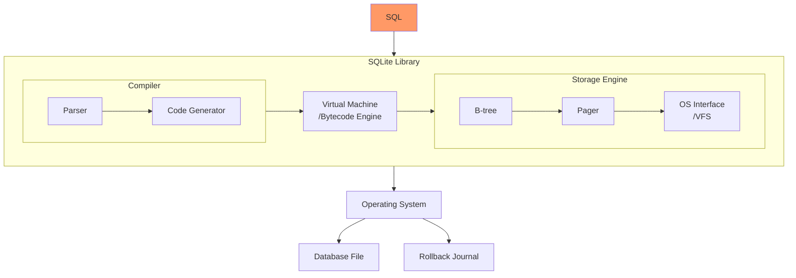
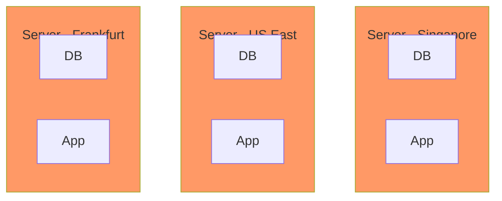

- [The Story of SQLite](#the-story-of-sqlite)
- [Architecture of SQLite](#architecture-of-sqlite)
- [The Renaissance of SQLite](#the-renaissance-of-sqlite)
  - [Serverless / Edge Computing](#serverless--edge-computing)
  - [Browser-compatible](#browser-compatible)
  - [Client/Server](#clientserver)
  - [OLAP](#olap)
  - [Distributed](#distributed)
- [Summary](#summary)

## The Story of SQLite

One of the first times I was blown away by SQLite was by [its test code](https://www.sqlite.org/testing.html), whose source code has more than 150,000 lines, but the test code and scripts actually have more than 90 million lines. The author, Dwayne Richard Hipp, is a perfectionist and wrote the underlying storage engine, [Parser](/dev/parser_black_magic/), the source hosting tool [Fossil](https://www2.fossil-scm.org/home/doc/trunk/www/index.wiki), Richard built the libraries or tools that SQLite depends on almost from scratch, except for the C compiler and some underlying libraries like libc.

The web server [Althttpd](https://sqlite.org/althttpd/doc/trunk/althttpd.md) that runs the official SQLite website was also built by Richard, with all the code in a single C file and no dependencies on any code libraries except the standard C library.

Of course, the database used by the [SQLite website](https://www.sqlite.org/) is also SQLite, and the [dynamic data](https://www.sqlite.org/src/timeline) of the website is even rendered in 0.01 seconds after more than 200 SQL statements are queried.

It's hard to imagine that this development model could work, but Richard did, and he pushed SQLite out to billions of devices and endpoints. Because the vast majority of the code was written by Richard alone, SQLite is not a collaborative open source project. While the code is open, there is no contribution from the open source community, and someone has even forked an open source collaborative version of SQLite specifically for this purpose: [libSQL](https://github.com/libsql/libsql).

For more on the history of SQLite, listen to this podcast: [The Untold Story of SQLite](https://corecursive.com/066-sqlite-with-richard-hipp/).

## Architecture of SQLite

SQLite is a database software, but it has a completely different way of working than most database systems. Most database systems (MySQL, SQL Server, PostgreSQL or Oracle) have a client/server architecture, where the client communicates with the database server through a specific protocol such as JDBC/ODBC, and the database server receives the query requests from the client by listening to a socket port, and then returns the results to the client.

Compared with other database network communication methods, SQLite is a library that communicates with the application through an in-process approach. SQLite's database is also a single file stored on disk.

The advantage of SQLite over other databases is that it is fast, especially for executing small SQL query statements, which is why SQLite's official website can obtain dynamic data by querying over 200 SQL statements. SQLite also does not have the problem of N+1 query performance because there is no overhead of network communication with other databases:

The architecture of SQLite is shown below.

The architecture of SQLite consists of three main parts: the compiler, the virtual machine and the storage engine. When the application initiates a query request, the SQL statement is first parsed by the compiler, then bytecode is generated, and finally executed by the virtual machine. During the execution of the virtual machine, the interface of the storage engine is called to read or write data.

The compiler's main job is to parse the SQL statement into bytecode and then compile the bytecode into executable machine code. The main components of the compiler are Parser and Code Generator. Parser is responsible for parsing SQL statements into abstract syntax trees (ASTs), and Code Generator is responsible for converting ASTs into bytecode. The generation of query plans is also done in Code Generator.

The [Virtual Machine](https://www.sqlite.org/opcode.html) is a Register-Based VM, whose main job is to execute bytecode. Query Optimization is also done in the VM. Readers interested in this part can read this article: [How the SQLite Virtual Machine Works](https://fly.io/blog/sqlite-virtual-machine/).

The main job of the storage engine is to read or write data. The main components of the storage engine are the B-tree, Pager and OS Interface (also called VFS).

- B-tree: SQLite's indexes are stored in B-tree data structure and table data are stored in B+tree data structure. Readers interested in this part can read this article: [SQLite Internals: Pages & B-trees](https://fly.io/blog/sqlite-internals-btree/).
- Pager(Page cache): The abstraction layer between B-tree module and VFS module, provides the function of reading, writing and caching disk pages. atomicity, isolation and persistence of SQLite are achieved by Pager.
  - Pager provides two concurrent access modes: [Rollback Journal](https://www.sqlite.org/atomiccommit.html) and pre-write-ahead log [(Write-ahead Log)](https://www.sqlite.org/wal.html). Compared to rollback logs, write-ahead logs provide better scalability and the ability to read data concurrently while writing data. In write-ahead logging mode, although a database can only have one write-ahead log file (-wal file) and only one write thread is allowed to update this file at a time, the configuration of [`busy_timeout`](https://sqlite.org/c3ref/busy_timeout.html) allows multiple write threads at the same time, but the execution is still serialized.
  - I recommend reading these two articles for this section: [How SQLite helps you do ACID](https://fly.io/blog/sqlite-internals-rollback-journal/) and [How SQLite Scales Read Concurrency ](https://fly.io/blog/sqlite-internals-wal/).
- OS Interface ([VFS](https://www.sqlite.org/vfs.html)): To provide portability across operating systems, SQLite uses an abstraction layer called VFS. VFS provides methods for opening, reading, writing, and closing disk files, as well as other operating system-specific functionality.

Above is a brief introduction to the SQLite architecture. If you want to further understand the internal implementation details, you can read this open-source e-book: [SQLite Internals: How The World's Most Used Database Works](https://www.compileralchemy.com/books/sqlite-internals/).

With this understanding, you will be able to better appreciate the following open-source projects that creatively utilize SQLite and showcase its versatility.

## The Renaissance of SQLite

SQLite is a not-so-new software that is over 20 years old, and many people still know it as <q>a toy-like database that is used for some simple local storage or testing, and rarely used in production</q>. But some interesting projects that have revived SQLite have been hotly discussed in [Hacker News](https://news.ycombinator.com/item?id=32478907) for a long time.

> Some things you may not think SQLite can do.
>
> - SQLite on a Single Server Million TPS Concurrency Crush Test: [Scaling SQLite to 4M QPS on a Single Server (EC2 vs Bare Metal)](https://blog.expensify.com/2018/01/08/scaling-sqlite-to-4m-qps-on-a-single-server/).
>
> - SQLite can support multiple concurrent writes in the future: the official [SQLite HC-tree](https://sqlite.org/hctree/doc/hctree/doc/hctree/index.html), trying to replace the old [B-tree](https://sqlite.org/src4/doc/trunk/www/bt.wiki) data structure, which enables multiple writes, multiple reads, distributed node replication and larger database size limits, [with good results in compression testing](https://sqlite.org/hctree/doc/hctree/doc/hctree/threadtest.wiki).

### Serverless / Edge Computing

Publishing static pages to a CDN and then using APIs to provide dynamic update capabilities, this Jamstack architecture of [Serverless](/en/dev/guide-to-serverless/) applications can bring extremely high scalability to business systems. The limitations of this architecture are that the data needs to be stored in a separate hosted database and is not cheap, and the database can be a performance bottleneck because the network overhead of a single-node database is a non-negligible problem when business systems are deployed to multiple regions.

What if the database and the business system instance are running on the same server? 🤯

SQLite is a Serverless database, which runs in the same process as the application. Compared to other databases, SQLite is faster than those with C/S architecture for network communication. The only problem is, how to solve the problem of multiple instances reading and writing to the same database? The following solutions are available for this problem.

[Litefs](https://github.com/superfly/litefs), this project is a new project developed by the author of [Litestream](https://github.com/benbjohnson/litestream) after joining Fly.io.

Litestream can control the management of `wal` log files by taking over the SQLite checkpointing process. In Write-ahead Log mode, litestream can continuously copy `wal` log files to the backup location such as S3, thus This enables online streaming backup of SQLite database files. See this document for details: [How it works - Litestream](https://litestream.io/how-it-works/).

Litefs goes a step further than Litestream by providing a FUSE-based file system to SQLite as the VFS layer. Litefs is able to replicate the collection of pages related to this transaction at the page level, and completes the cross-node synchronization of data by packaging these page collections into a file package in LTX data format and then sending this file package to the read-only node via HTTP protocol.

In the distributed cluster of Litefs, only the master node can write data, and the read-only node can let the client write data only at the master node by forwarding the address of the master node to the client. The master node is elected by obtaining distributed leases (Distributed leases) from Consul to reach consensus, and static master nodes can also be set.

For the specific architecture, refer to this article: [How LiteFS Works - Fly Docs](https://fly.io/docs/litefs/how-it-works/). A deployment case can refer to this article: [I Migrated from a Postgres Cluster to Distributed SQLite with LiteFS](https://news.ycombinator.com/item?id=34267434).

Also Cloudflare has released a similar commercial solution [Cloudflare D1](https://developers.cloudflare.com/d1/).

### Browser-compatible

SQLite can run in the browser via WebAssembly (WASM) technology, and the following two projects enable the use of SQL in the browser.

- [sql.js](https://github.com/sql-js/sql.js/): Using this library, Javascript can download the SQLite database file into the browser's memory via network request, and later use SQL to retrieve the data results from the SQLite database file, all while happening just within the browser.
- [absurd-sql](https://github.com/jlongster/absurd-sql): The difference with sql.js is that this project can use the browser's IndexedDB as persistent storage, and can read and write SQLite database files.

> What are the advantages of using SQLite in the browser? Take this open source project of mine [Invest Alchemy](https://github.com/bmpi-dev/invest-alchemy) as an example, it is an ETF portfolio management system, it needs to manage multiple ETF portfolios, all the data of each ETF portfolio is stored in a SQLite database, and the location of this database file is stored in AWS S3. Every day, a scheduled program automatically downloads all SQLite databases to the AWS S3 bucket, after which the data of these portfolios is updated and finally uploaded to S3. When a user views a page of a portfolio, take this [portfolio](https://money.bmpi.dev/portfolio?t=robot_dma_v02&p=dma_11_22) as an example, the page will first download the SQLite database from S3 to the browser's memory when it is first rendered, and later use sql.js to initialize the SQLite database, and finally launch multiple SQL queries to get the data results and then render the page.
>
> The advantage of this architecture is that the browser page only needs to make one query request to get all the data for the entire portfolio. When using a traditional database, this is a matter of cost, and each query must be transmitted over the network, which increases the load time of the page.
>
> Finally, SQLite, a single database file approach, brings a good isolation. For example, in Invest Alchemy, one database represents one portfolio, and of course it is possible to store all the personal data of one user in one database, and then store these databases in different directories in AWS S3, so that the data of different users can be well isolated.

### Client/Server

SQLite can also be used as a Client/Server architecture database. Of course this usage has lost the advantages of SQLite and increases the network overhead, but it may be useful in some scenarios, such as as as a read-only data source, or as a data cache, where the overhead should be lower.

- [postlite](https://github.com/benbjohnson/postlite): a web proxy library that supports PostgreSQL's communication protocol and uses SQLite as storage on the back end.
- [sqlite3vfshttp](https://github.com/psanford/sqlite3vfshttp): a SQLite VFS that supports accessing SQLite database files via HTTP protocol. Compared to sql.js which needs to download the whole SQLite database file, this library only needs to specify the `HTTP range` header by the client to get the data of the specified range. In a large database file, this optimization can save a lot of network overhead.
- [Cloud Backed SQLite](https://sqlite.org/cloudsqlite/doc/trunk/www/index.wiki): officially supported cloud SQLite, supports Azure and GCP, can read or write directly through Storage Client database without downloading the whole database.

### OLAP

SQLite is typically used as an OLTP database and rarely used for OLAP because its table data storage is row-based rather than column-based. For this reason [duckdb](https://github.com/duckdb/duckdb) fills this gap with a similar architecture to SQLite, except that it is columnar storage, which is perfect for OLAP business scenarios.

However, SQLite in [3.38.0](https://www.sqlite.org/releaselog/3_38_0.html) improves the performance of large analytic query statements with Bloom Filter, a feature that is also designed to support OLAP business scenarios. Of course, more recent optimization and comparison with duckdb can be found in this paper: [Introducing a Query Acceleration Path for Analytics in SQLite3](https://www.cidrdb.org/cidr2022/papers/p56-prammer.pdf).

### Distributed

SQLite in-process architecture seems to be totally irrelevant to distributed database, and distributed database itself is a very complex field, distributed brings the ability of elastic expansion and high availability of the database, due to the complexity of distributed transactions, the conventional practice is to solve the problem of expansion by means of vertical expansion of single machine as far as possible, and there's really no way to solve it by means of horizontal The problem can't be solved by horizontal scaling (slicing). However, there are still the following amazing projects that bring SQLite into the realm of distribution.

- [rqlite](https://github.com/rqlite/rqlite): Using [Raft](https://raft.github.io/) to solve the problem of reaching consensus among distributed cluster nodes, writing is done through the Leader node, and other replica nodes can pass through the write request to the Leader nodes, and reads are done by any node, so this is also a `Leader-Replica` style of distributed architecture.
  - rqlite does not improve write throughput because writes are still done by the Leader and there is additional consistency checking overhead, which reduces write throughput compared to the In-Process standalone SQLite.
  - The rqlite data API is publicly available via HTTP, so it is a Client/Server style of architecture.
  - The inter-node synchronization of rqlite is achieved by copying commands, e.g. when a write command is sent to the Leader node, once the command is submitted to Raft Log, the Leader node will copy the write command to other nodes.
  - The design document is available here: [Rqlite Design](https://rqlite.io/docs/design/).
- [mvsqlite](https://github.com/losfair/mvsqlite): The subtlety of this project lies in its use of [FoundationDB](https://github.com/apple/foundationdb) as the VFS layer of SQLite. It makes great use of the distributed features provided by FoundationDB (optimistic lock-free concurrency, distributed transactions, synchronous asynchronous replication, backup and recovery) to achieve a distributed SQLite with MVCC support, not only `Leader-Replica` but also parallelization of multi-node writes, [increasing the throughput of writes](https://su3.io/posts/mvsqlite-bench-20220930). Because of its implementation of MVCC, it even enables time travel at the database level (Time travel).
  - We recommend reading these two articles by the author for implementation details: 1. [Turning SQLite into a distributed database](https://su3.io/posts/mvsqlite), 2. [Storage and transaction in mvSQLite]( https://su3.io/posts/mvsqlite-2).
  - Compared with Litefs, which is also distributed through the VFS module, mvsqlite requires additional deployment of `FoundationDB` cluster and `mvstore` stateless instances, so the deployment and O&M costs are higher.
  - Interestingly, FoundationDB used SQLite as the SSD storage engine before `7.0.0`, but after that, FoundationDB implemented its own storage engine [Redwood](https://youtu.be/nlus1Z7TVTI).
- [cr-sqlite](https://github.com/vlcn-io/cr-sqlite): The previous project such as rqlite implements distributed in a way that a certain Leader is elected by consensus algorithm, after which the Leader makes changes to the data to achieve ultimate consistency. What if multiple writers make changes to the same database at the same time without conflict? We know that a data structure exists in the field of real-time collaboration to solve multiple people's real-time collaboration with conflict-free replication: [CRDT](https://crdt.tech/). This cr-sqlite project cleverly brings CRDT into SQLite through SQLite's [runtime extension](https://www.sqlite.org/loadext.html), and finally achieves the same cluster multi-node concurrent writing feature as mvsqlite.
  - I recommend reading this article by the author: [Why SQLite? Why Now?](https://tantaman.com/2022-08-23-why-sqlite-why-now.html)
- [Bedrock](https://github.com/Expensify/Bedrock): Bedrock is a web and distributed transaction layer built on top of SQLite. It is a distributed relational database management system designed for offsite replication. Using a P2P style of distributed architecture, data is eventually written to a private blockchain of all nodes. 🤯
  - Bedrock uses the Paxos distributed consensus algorithm to elect cluster Leaders, who are responsible for coordinating distributed two-phase commit transactions.
  - Bedrock's [synchronization engine](https://bedrockdb.com/synchronization.html) is a [private blockchain](https://bedrockdb.com/blockchain.html). Each thread has an internal table called journal, which has 3 columns called id, query, and hash. Each time a query is committed to the database, a new row is inserted into the journal. The new row records the query and calculates a new incremental hash value based on the previous row. When a server connects to a cluster, the latest ID and hash values are broadcast. If two servers disagree on the hash value corresponding to the ID, then they know they "forked" at some point and stop communicating with each other. leader decides which fork can become the new master branch.

## Summary

How is it that SQLite has become such an innovative project in so many areas? It is partly due to the high quality of the SQLite code, with nearly 100 million lines of test code to ensure its rock-solid reliability, and partly due to its simple architecture, with only 150,000 lines of source code in total.

Compare this to other databases such as MySQL with over 4 million lines of source code, Oracle with over 10 million lines of source code, and even Postgres with over a million lines of source code. Just as it's hard to make an elephant dance, it's hard for individual developers to go it alone and innovate on code of this size. And SQLite's simple architecture and small amount of code make it a great platform for experimentation, allowing developers to do all kinds of innovation on top of SQLite.

With the popularity of serverless and edge computing running on the CDN, SQLite, a lightweight relational database, will see more use cases and more innovation. SQLite is also a great database to learn, its source code is very simple and can help you understand the principles of the database.
