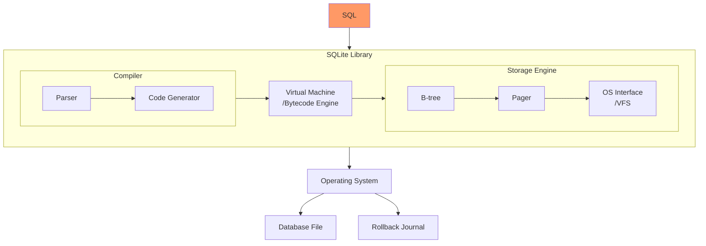
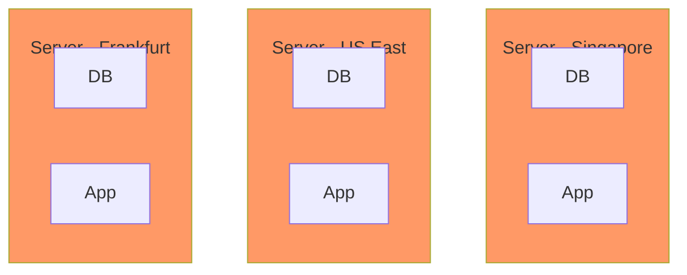

- [The Story of SQLite](#the-story-of-sqlite)
- [Architecture of SQLite](#architecture-of-sqlite)
- [The Renaissance of SQLite](#the-renaissance-of-sqlite)
  - [Serverless / Edge Computing](#serverless--edge-computing)
  - [Browser-compatible](#browser-compatible)
  - [Client/Server](#clientserver)
  - [OLAP](#olap)
  - [Distributed](#distributed)
- [Summary](#summary)

## The Story of SQLite

When I first encountered SQLite, I was struck by its impressive test code, which spans over 150,000 lines of source code and over 90 million lines of test code and scripts. The author, Dwayne Richard Hipp, is a perfectionist who not only developed the underlying storage engine and Parser, but also created the source hosting tool [Fossil](https://www2.fossil-scm.org/home/doc/trunk/www/index.wiki), as well as the libraries and tools that SQLite depends on, mostly from scratch. 

Richard even built the web server, [Althttpd](https://sqlite.org/althttpd/doc/trunk/althttpd.md), that runs the official SQLite website, with all the code in a single C file and no dependencies on any code libraries except the standard C library. The SQLite website's database is also powered by SQLite, and its dynamic data is rendered in just 0.01 seconds after over 200 SQL statements are queried.

It's remarkable that this development model has been successful, considering the vast majority of the code was written by Richard alone. Although the code is open-source, there is no contribution from the open-source community. In fact, someone has even forked an open-source collaborative version of SQLite, specifically for this purpose: [libSQL](https://github.com/libsql/libsql).

To learn more about the history of SQLite, check out this podcast: [The Untold Story of SQLite](https://corecursive.com/066-sqlite-with-richard-hipp/).

## Architecture of SQLite

SQLite is a unique database software that functions differently from most other database systems, such as MySQL, SQL Server, PostgreSQL, or Oracle, which have a client/server architecture. In the client/server model, the client communicates with the database server via a specific protocol, and the server receives and processes the client's requests before returning the results.

Unlike these database systems, SQLite communicates with the application via an in-process approach, functioning as a library. Additionally, the database in SQLite is a single file stored on disk, giving it another advantage over other databases. SQLite is notably fast, especially when executing small SQL query statements. This speed has made it possible for SQLite's official website to obtain dynamic data by querying over 200 SQL statements, without the N+1 query performance overhead of network communication present in other databases.

The architecture of SQLite is illustrated below:

The architecture of SQLite is composed of three main parts: the compiler, the virtual machine, and the storage engine. When an application initiates a query request, the SQL statement is parsed by the compiler, and bytecode is generated. Finally, the virtual machine executes the bytecode, calling the storage engine's interface to read or write data.

The compiler consists of Parser and Code Generator, responsible for parsing SQL statements into abstract syntax trees (ASTs) and converting ASTs into bytecode, respectively. Code Generator also generates query plans.

The [Virtual Machine](https://www.sqlite.org/opcode.html) is a Register-Based VM responsible for executing bytecode, and it also handles query optimization. Readers interested in this part can read this article: [How the SQLite Virtual Machine Works](https://fly.io/blog/sqlite-virtual-machine/).

The storage engine's main responsibility is reading or writing data. It includes the B-tree, Pager, and OS Interface (also called VFS).

- B-tree: SQLite's indexes are stored in B-tree data structure and table data are stored in B+tree data structure. For readers interested in this topic, I recommend reading this article: [SQLite Internals: Pages & B-trees](https://fly.io/blog/sqlite-internals-btree/).

- Pager: Serves as an abstraction layer between the B-tree module and VFS module. It provides the function of reading, writing, and caching disk pages, achieving atomicity, isolation, and persistence in SQLite. Pager offers two concurrent access modes: Rollback Journal and Write-ahead Log. The Write-ahead Logging mode provides better scalability and allows reading data concurrently while writing data. Although only one write thread is allowed to update the write-ahead log file at a time, the configuration of [`busy_timeout`](https://sqlite.org/c3ref/busy_timeout.html) allows multiple write threads, but execution remains serialized. For more information, refer to these articles: 
  - [How SQLite helps you do ACID](https://fly.io/blog/sqlite-internals-rollback-journal/) 
  - [How SQLite Scales Read Concurrency](https://fly.io/blog/sqlite-internals-wal/)

- OS Interface (VFS): To provide portability across operating systems, SQLite uses an abstraction layer called VFS. VFS provides methods for opening, reading, writing, and closing disk files, as well as other operating system-specific functionality. For readers interested in this topic, I recommend reading the [SQLite documentation on VFS](https://www.sqlite.org/vfs.html).

Above is a brief introduction to the SQLite architecture. If you want to further understand the internal implementation details, you can read this open-source e-book: [SQLite Internals: How The World's Most Used Database Works](https://www.compileralchemy.com/books/sqlite-internals/).

This understanding will help you appreciate the following open-source projects that creatively utilize SQLite, showcasing its versatility.

## The Renaissance of SQLite

SQLite, a software that is over 20 years old, is often seen as a database for simple local storage or testing, and rarely used in production. However, there are several interesting projects that have revived SQLite and have been hotly discussed in forums such as Hacker News. Let's take a look at some of these projects.

### Serverless / Edge Computing

Jamstack architecture for [serverless](/en/dev/guide-to-serverless/) applications involves publishing static pages to a CDN and using APIs to provide dynamic updates. This architecture can greatly enhance scalability for business systems. However, there are limitations to this approach. Data must be stored in a separate hosted database, which can be expensive, and the database can become a performance bottleneck. This is particularly true when business systems are deployed to multiple regions. But what if the business system instance and the database were running on the same server? This approach has the potential to eliminate the network overhead of a single-node database, offering a more efficient solution.

SQLite is a Serverless database, which runs in the same process as the application. Compared to other databases, SQLite is faster than those with C/S architecture for network communication. However, a common problem when multiple instances are reading and writing to the same database needs to be addressed. One possible solution is [Litefs](https://github.com/superfly/litefs), a project developed by the author of [Litestream](https://github.com/benbjohnson/litestream) after joining Fly.io.

Litestream is capable of controlling the management of `wal` log files by taking over the SQLite checkpointing process. When operating in Write-ahead Log mode, Litestream can continuously copy `wal` log files to the backup location, such as S3, enabling online streaming backup of SQLite database files. For more information, see this [document](https://litestream.io/how-it-works/) detailing how it works.

Litefs takes it a step further than Litestream by providing a FUSE-based file system to SQLite as the VFS layer. Litefs can replicate the collection of pages related to a transaction at the page level and complete the cross-node synchronization of data by packaging these page collections into a file package in LTX data format and sending this package to the read-only node via HTTP protocol.

In the distributed cluster of Litefs, only the master node can write data, and the read-only node can let the client write data only at the master node by forwarding the address of the master node to the client. The master node is elected by obtaining distributed leases (Distributed leases) from Consul to reach consensus, and static master nodes can also be set.

For details about Litefs' specific architecture, please refer to this [article](https://fly.io/docs/litefs/how-it-works/). A deployment case can be found in this [thread](https://news.ycombinator.com/item?id=34267434), which discusses a migration from a Postgres cluster to distributed SQLite with Litefs.

Cloudflare has also released a similar commercial solution, [Cloudflare D1](https://developers.cloudflare.com/d1/).

### Browser-compatible

SQLite can be run in the browser using WebAssembly (WASM) technology, and there are two projects that enable the use of SQL within the browser.

- [sql.js](https://github.com/sql-js/sql.js/) allows JavaScript to download the SQLite database file into the browser's memory via network request. SQL can then be used to retrieve data results from the SQLite database file all within the browser.
- [absurd-sql](https://github.com/jlongster/absurd-sql) is similar to sql.js, but it can use the browser's IndexedDB as persistent storage and can read and write SQLite database files.

> What are the advantages of using SQLite in the browser? Take this open source project of mine [Invest Alchemy](https://github.com/bmpi-dev/invest-alchemy) as an example. It is an ETF portfolio management system that needs to manage multiple ETF portfolios, and all the data of each ETF portfolio is stored in a SQLite database. The location of this database file is stored in AWS S3. Every day, a scheduled program automatically downloads all SQLite databases to the AWS S3 bucket. After which, the data of these portfolios is updated and finally uploaded to S3.
>
> When a user views a page of a portfolio, such as this [portfolio](https://www.myinvestpilot.com/portfolio?t=robot_dma_v02&p=dma_11_22), the page will first download the SQLite database from S3 to the browser's memory when it is first rendered. Later, it uses sql.js to initialize the SQLite database and launches multiple SQL queries to get the data results, then renders the page.
>
> The advantage of this architecture is that the browser page only needs to make one query request to get all the data for the entire portfolio. When using a traditional database, this is a matter of cost, and each query must be transmitted over the network, which increases the load time of the page.
>
> Finally, SQLite's single database file approach brings good isolation. For example, in Invest Alchemy, one database represents one portfolio. It is possible to store all the personal data of one user in one database and then store these databases in different directories in AWS S3 so that the data of different users can be well isolated.

### Client/Server

SQLite can be used as a Client/Server architecture database, although this usage can come at the cost of losing some of the advantages of SQLite and increasing the network overhead. Nevertheless, it can be useful in certain scenarios, such as a read-only data source or as a data cache where the overhead is minimal.

Here are a few projects that demonstrate the use of SQLite in a client-server architecture:

- [Postlite](https://github.com/benbjohnson/postlite): A web proxy library that supports PostgreSQL's communication protocol and uses SQLite as storage on the backend.
- [sqlite3vfshttp](https://github.com/psanford/sqlite3vfshttp): A SQLite VFS that supports accessing SQLite database files via HTTP protocol. Compared to sql.js, which needs to download the whole SQLite database file, this library only needs to specify the `HTTP range` header by the client to get the data of the specified range. In a large database file, this optimization can save a lot of network overhead.
- [Cloud Backed SQLite](https://sqlite.org/cloudsqlite/doc/trunk/www/index.wiki): Officially supported cloud SQLite, supports Azure and GCP, can read or write directly through Storage Client database without downloading the whole database.

### OLAP

SQLite is commonly used as an OLTP database but is rarely used for OLAP since its table data storage is row-based rather than column-based. To fill this gap, [DuckDB](https://github.com/duckdb/duckdb) was developed, which has a similar architecture to SQLite but uses columnar storage, making it perfect for OLAP scenarios.

However, starting from version [3.38.0](https://www.sqlite.org/releaselog/3_38_0.html), SQLite has improved the performance of large analytic query statements using Bloom Filters, which is also designed to support OLAP scenarios. More information on this optimization and a comparison with DuckDB can be found in [this paper](https://www.cidrdb.org/cidr2022/papers/p56-prammer.pdf).

### Distributed

The in-process architecture of SQLite is not relevant to distributed databases, which are a complex field. Distributed databases offer elastic expansion and high availability, but due to the complexity of distributed transactions, conventional practice involves vertical scaling of a single machine as much as possible. Horizontal scaling (slicing) is not a feasible solution. Nevertheless, there are some impressive projects that have brought SQLite into the realm of distributed systems.

- [rqlite](https://github.com/rqlite/rqlite) is a distributed database that uses [Raft](https://raft.github.io/) to solve the problem of achieving consensus among nodes in a cluster. In this architecture, writes are performed through the Leader node, and the other replica nodes can pass write requests to the Leader node. Meanwhile, reads can be done by any node, making this a `Leader-Replica` style of distributed architecture.
  
  However, because writes are still performed by the Leader node and there is additional overhead due to consistency checking, rqlite does not significantly improve write throughput compared to the In-Process standalone SQLite.
  
  The rqlite data API is publicly available via HTTP, which makes it a Client/Server style of architecture. To achieve inter-node synchronization, rqlite copies commands between nodes. For example, when a write command is sent to the Leader node and submitted to Raft Log, the Leader node copies the write command to other nodes.
  
  If you're interested in learning more about rqlite's design, you can check out the documentation available here: [Rqlite Design](https://rqlite.io/docs/design/).

- [mvsqlite](https://github.com/losfair/mvsqlite): The subtlety of this project lies in its use of [FoundationDB](https://github.com/apple/foundationdb) as the VFS layer of SQLite. It makes great use of the distributed features provided by FoundationDB, such as optimistic lock-free concurrency, distributed transactions, synchronous asynchronous replication, and backup and recovery, to achieve a distributed SQLite with MVCC support. This includes not only `Leader-Replica`, but also parallelization of multi-node writes, which increases the throughput of writes and enables time travel at the database level (Time travel) thanks to its implementation of MVCC.
  
  To learn more about the implementation details of mvsqlite, we recommend reading these two articles by the author: 
  1. [Turning SQLite into a distributed database](https://su3.io/posts/mvsqlite)
  2. [Storage and transaction in mvSQLite]( https://su3.io/posts/mvsqlite-2)
  
  Compared with Litefs, which is also distributed through the VFS module, mvsqlite requires additional deployment of `FoundationDB` cluster and `mvstore` stateless instances, resulting in higher deployment and O&M costs.
  Interestingly, FoundationDB used SQLite as the SSD storage engine before `7.0.0`, but after that, FoundationDB implemented its own storage engine called [Redwood](https://youtu.be/nlus1Z7TVTI).

- [cr-sqlite](https://github.com/vlcn-io/cr-sqlite): To achieve ultimate consistency, the previous project, rqlite, used a consensus algorithm to select a particular leader. However, what if multiple writers need to make changes to the same database at the same time without conflict? Fortunately, a data structure called [CRDT](https://crdt.tech/) (Conflict-free Replicated Data Type) exists in the real-time collaboration field to solve this problem. The cr-sqlite project has ingeniously integrated CRDT into SQLite through its [runtime extension](https://www.sqlite.org/loadext.html), resulting in the same cluster multi-node concurrent writing feature as mvsqlite. For more information, I recommend reading the author's article on [Why SQLite? Why Now?](https://tantaman.com/2022-08-23-why-sqlite-why-now.html).

- [Bedrock](https://github.com/Expensify/Bedrock): Bedrock is an advanced web and distributed transaction layer built with the help of SQLite. It functions as a distributed relational database system that has been designed primarily for replicating offsite data. Using a peer-to-peer style of distributed architecture, information is eventually stored on a private blockchain across all nodes. 🤯
  
  The Paxos consensus algorithm is used by Bedrock in order to select Leaders from clusters. They are responsible for organizing two-phase commit transactions across different systems. Moreover, its [synchronization engine](https://bedrockdb.com/synchronization.html) is based on the implementation of [blockchain](https://bedrockdb.com/blockchain.html) technology.

  Each node contains an internal table referred to as the journal – it consists of 3 columns: id, query, and hash. Every time a query is committed into the database, a new row is added to the journal. This records the query and computes a unique hash value according to the most recent row.

  When a server links up with a cluster, the newest hashes and IDs are shared. If two distinct servers dispute over the assigned hash corresponding to the ID, they will recognize they were “forked” at some point and stop exchanging messages. In such situations, the leader decides which fork is deserving of becoming the master branch.

## Summary

It is no secret that SQLite has become a highly innovative project in many areas. This is in large part due to the high-quality of its source code, boasting almost 100 million lines dedicated to testing and verifying its robustness. This minimalistic architecture constrains the total source code to just over 150,000 lines, which enables individual developers to individually innovate on it more easily compared to databases like MySQL (with over 4 million lines), Oracle (with over 10 million lines), or Postgres (over 1 million lines).

This simple layout also makes SQLite a great platform for experimentation; developers can implement a vast array of modifications with relative ease. As edge computation and serverless deployments run off of Content Delivery Networks, SQLite - being a lightweight relational database - will only see further use cases and innovation flow into it. Moreover, since its codebase is straightforward, those wishing to learn about SQLite principles can do so quickly.
