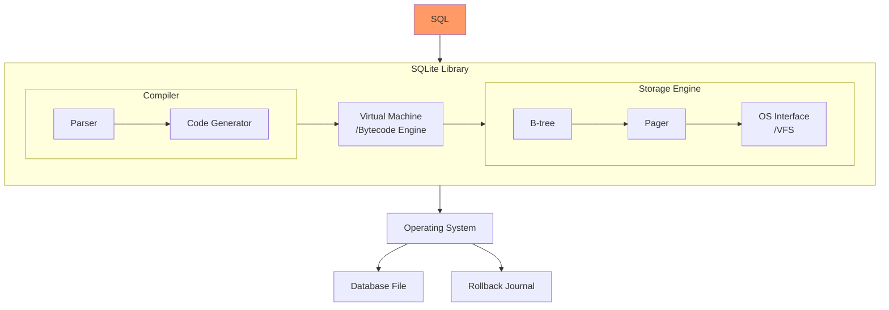
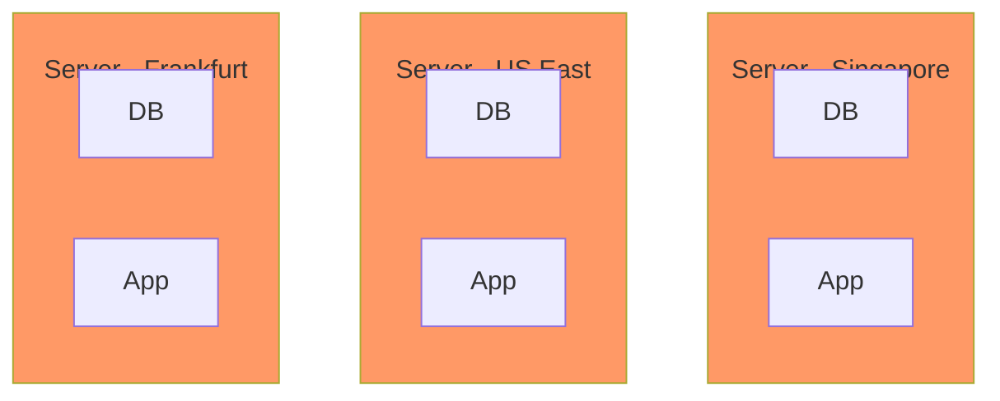

{}
<strong>初稿征集意见中</strong> 
本文处于初稿状态，可能存在很多错误，如果你有不同的看法，欢迎不吝赐教，先行感谢！
{}

- [SQLite的故事](#sqlite的故事)
- [SQLite的架构](#sqlite的架构)
- [SQLite的文艺复兴](#sqlite的文艺复兴)
  - [Serverless / Edge Computing](#serverless--edge-computing)
  - [Browser-compatible](#browser-compatible)
  - [Client/Server](#clientserver)
  - [OLAP](#olap)
  - [分布式](#分布式)
- [总结](#总结)

## SQLite的故事

第一次被SQLite震撼到的一个是关于[它的测试代码](https://www.sqlite.org/testing.html)，其源码有15多万行，但测试代码和脚本竟有九千多万行。作者Dwayne Richard Hipp是一个完美主义者，为了能自由的开发SQLite，他编写了底层的存储引擎、[Parser](/dev/parser_black_magic/)、源码托管工具[Fossil](https://www2.fossil-scm.org/home/doc/trunk/www/index.wiki)，除了C编译器和一些底层库如libc外，Richard几乎从零构建了SQLite所依赖的库或工具。

运行SQLite官网的Web服务器[Althttpd](https://sqlite.org/althttpd/doc/trunk/althttpd.md)也是Richard开发的，所有代码仅在一个C文件中，除了标准C库之外没有依赖任何其他代码库。

当然[SQLite官网](https://www.sqlite.org/)使用的数据库自然也是SQLite了，网页的[动态数据](https://www.sqlite.org/src/timeline)甚至是由200多条SQL语句查询后在0.01秒内渲染完成的。

很难想象这种开发模式能够成功，但Richard做到了，他把SQLite推向了数十亿的设备与终端。由于绝大部分代码都是Richard一个人完成的，SQLite并不是一个开源协作的项目。虽然代码是开放的，但却并没有开源社区的贡献，甚至有人为此专门fork出了SQLite的开源协作版本：[libSQL](https://github.com/libsql/libsql)。

更多关于SQLite背后的故事可以听下这期Podcast：[The Untold Story of SQLite](https://corecursive.com/066-sqlite-with-richard-hipp/)。

## SQLite的架构

SQLite是一个数据库软件，但与绝大部分数据库系统拥有完全不同的运行方式。大部分数据库（MySQL、SQL Server、PostgreSQL或Oracle）系统是Client/Server的架构，客户端通过特定的协议比如JDBC/ODBC与数据库服务器通信，数据库服务器通过监听某个Socket端口去接收客户端的查询请求，之后将结果返回给客户端。

与其他数据库网络通信的方式相比，SQLite是一个库，它是通过In-Process的方式来与应用程序通信的。当应用程序发出查询请求时，这些请求是通过函数调用的方式在与应用程序相同的线程内执行的。SQLite的数据库也是存放在磁盘上的单个文件。

与其他数据库相比，SQLite的优势就是快，尤其是执行一些小的SQL查询语句，这也是为什么SQLite的官网动态数据能通过200多条SQL语句来查询获取的。SQLite也没有N+1查询性能的问题，原因就是没有其他数据库网络通信的开销：

SQLite的架构如下：

SQLite的架构主要包括三大部分：编译器、虚拟机与存储引擎。当应用程序发起查询请求时，SQL语句首先会被编译器解析，然后生成字节码，最后通过虚拟机执行。虚拟机的执行过程中，会调用存储引擎的接口来读取或写入数据。

编译器的主要工作是将SQL语句解析成字节码，然后将字节码编译成可执行的机器码。编译器的主要组成部分是Parser与Code Generator，Parser负责将SQL语句解析成抽象语法树（AST），Code Generator负责将AST转换成字节码。查询计划的生成也是在Code Generator中完成的。

[虚拟机](https://www.sqlite.org/opcode.html)是一个寄存器式虚拟机(Register-Based VM)，它的主要工作是执行字节码。另外查询优化(Query Optimization)也是在虚拟机中完成的。对此部分感兴趣的读者可阅读这篇文章：[How the SQLite Virtual Machine Works](https://fly.io/blog/sqlite-virtual-machine/)。

存储引擎的主要工作是读取或写入数据。存储引擎的主要组成部分是B-tree、Pager与OS Interface（也叫VFS）：

- B-tree：SQLite的索引以B-tree的数据结构存储，表数据是以B+tree的数据结构存储。对于此部分感兴趣的读者可阅读这篇文章：[SQLite Internals: Pages & B-trees](https://fly.io/blog/sqlite-internals-btree/)。
- Pager(Page cache)：B-tree模块与VFS模块之间的抽象层，提供读、写与缓存磁盘页面的功能。SQLite的原子性、隔离性、持久性都是通过Pager来实现的。
  - Pager提供了两种并发访问模式：[回滚日志(Rollback Journal)](https://www.sqlite.org/atomiccommit.html)与预写日志[(Write-ahead Log)](https://www.sqlite.org/wal.html)。与回滚日志相比，预写日志能提供更好的扩展性，能在写入数据时并发读取数据。在预写日志模式下，虽然一个数据库只能拥有一个预写日志文件(-wal文件)，一次只能允许有一个写入线程去更新这个文件，但在配置[`busy_timeout`](https://sqlite.org/c3ref/busy_timeout.html)后允许有多个写入线程同时运行，不过执行过程仍然是串行化的。
  - 对于此部分我推荐阅读这两篇文章：[How SQLite helps you do ACID](https://fly.io/blog/sqlite-internals-rollback-journal/)与[How SQLite Scales Read Concurrency](https://fly.io/blog/sqlite-internals-wal/)。
- OS Interface([VFS](https://www.sqlite.org/vfs.html))：为了提供跨操作系统的可移植性，SQLite使用了一个称为VFS的抽象层。VFS提供了打开、读取、写入和关闭磁盘文件的方法，以及其他特定于操作系统的功能。

以上就是SQLite架构的简单介绍，如果你还希望进一步了解内部实现细节，可以阅读这本开源电子书：[SQLite Internals: How The World's Most Used Database Works](https://www.compileralchemy.com/books/sqlite-internals/)。

理解了这些，你就能够更好的了解下面这些把SQLite玩出花活的<q>文艺复兴</q>类开源项目了。

## SQLite的文艺复兴

SQLite是个已经超过20岁高龄的并不新的软件，很多人对它的认知还停留在<q>一个玩具类的数据库，拿它用来做一些简单的本地存储或测试，很少用来在生产系统中使用</q>。但就是这样古老的软件，却长期在[Hacker News](https://news.ycombinator.com/item?id=32478907)中被热议，因为一些有趣的项目，让SQLite老树逢春、文艺复兴。

> 一些你可能觉得SQLite做不到的事：
>
> - SQLite单机百万TPS并发压测：[Scaling SQLite to 4M QPS on a Single Server (EC2 vs Bare Metal)](https://blog.expensify.com/2018/01/08/scaling-sqlite-to-4m-qps-on-a-single-server/)。
>
> - SQLite未来可支持多个并发写入: 官方出品的[SQLite HC-tree](https://sqlite.org/hctree/doc/hctree/doc/hctree/index.html)，尝试替换老的[B-tree](https://sqlite.org/src4/doc/trunk/www/bt.wiki)数据结构，能实现多写多读、分布式节点复制与更大的数据库大小限制，[压测结果很不错](https://sqlite.org/hctree/doc/hctree/doc/hctree/threadtest.wiki)。

### Serverless / Edge Computing

将静态页面发布到CDN中，然后使用API提供动态更新的能力，这种[Jamstack](/dev/pulumi-aws-serverless-hugo-site-vists/)架构的[Serverless](/dev/guide-to-serverless/)应用能给业务系统带来极高的伸缩性。这种架构的限制在于，数据需要存放在单独的托管数据库中，并且费用不便宜，而且数据库可能会成为一个性能瓶颈，因为当业务系统部署到多区域时，单节点的数据库的网络开销是个不容忽视的问题。

那如果数据库与业务系统实例在同一个服务器上运行呢？🤯

SQLite本身就是一个Serverless的数据库，它与应用程序运行在同一进程中。相比其他数据库，同样运行在与应用程序同一个服务器中，SQLite都比那些C/S架构网络通信类的数据库要更快。唯一的问题是，如何解决多实例读取与写入同一数据库？针对此问题有以下解决方案：

[Litefs](https://github.com/superfly/litefs)，此项目是[Litestream](https://github.com/benbjohnson/litestream)作者加入Fly.io后开发的新项目。

Litestream能通过接管SQLite检查点过程(checkpointing process)从而控制对`wal`日志文件的管理，在预写日志(Write-ahead Log)模式下，litestream能持续的复制`wal`日志文件到备份的位置如S3中，从而实现了在线流式备份SQLite数据库文件。具体可以查看此文档介绍：[How it works - Litestream](https://litestream.io/how-it-works/)。

Litefs相比Litestream要更进一步。Litefs通过提供一个基于FUSE的文件系统给SQLite做VFS层，当Leader节点要更新数据库时，该节点的SQLite的Pager模块要调用VFS层写入数据时，Litefs能够在页面级别复制与这个事务相关的页面集合，通过把这些页面集合打包成一个LTX数据格式的文件包，然后通过HTTP协议将这个文件包发送给只读节点，完成了数据的跨节点同步。

在Litefs的分布式集群中，只有主节点能够写入数据，只读节点可以通过将主节点地址转发给客户端，让客户端只在主节点写入数据。主节点的选举通过获取Consul的分布式租约(Distributed leases)来达成共识，也可以设置静态的主节点。

具体的架构参考这篇文章：[How LiteFS Works · Fly Docs](https://fly.io/docs/litefs/how-it-works/)。一个部署案例可以参考这篇文章：[I Migrated from a Postgres Cluster to Distributed SQLite with LiteFS](https://news.ycombinator.com/item?id=34267434)。

另外Cloudflare也推出了类似的商业解决方案[Cloudflare D1](https://developers.cloudflare.com/d1/)。

### Browser-compatible

SQLite可以通过WebAssembly(WASM)技术运行在浏览器中，以下两个项目能让前端代码在浏览器中发起SQL查询：

- [sql.js](https://github.com/sql-js/sql.js/)：JS代码导入该库后，通过网络请求下载SQLite数据库文件到浏览器内存中，即可发起SQL查询获取数据结果。
- [absurd-sql](https://github.com/jlongster/absurd-sql)：和sql.js的区别在于，该项目可以使用浏览器的IndexedDB作为持久化存储，能对SQLite数据库文件进行读写操作。

在浏览器中使用SQLite有什么好处？以我的这个[Invest Alchemy](https://github.com/bmpi-dev/invest-alchemy)开源项目为例，它是一个ETF投资组合管理系统，它需要管理多个ETF投资组合，每个ETF投资组合的所有数据都存放在一个SQLite数据库中，而这个数据库文件存放的位置是在AWS S3中。每天都会有一个定时程序自动下载AWS S3桶中所有的SQLite数据库，之后更新这些组合的数据，最后再上传至S3中。当用户浏览某个投资组合的页面，以这个[投资组合](https://money.bmpi.dev/portfolio?t=robot_dma_v02&p=dma_11_22)为例，该页面在初始化渲染时会先从S3中下载SQLite数据库到浏览器内存，之后使用sql.js初始化SQLite数据库，最后发起多个SQL查询获取数据结果，然后渲染页面。

这种架构的好处在于，浏览器页面只需要发起一次查询请求，就可以获取整个组合的全部数据。如果使用传统的数据库，一方面是费用的问题，另外一方面每次查询都需要经过网络传输，这样会增加页面的加载时间。

最后，SQLite这种单数据库文件的方式，带来了很好的隔离性。比如在Invest Alchemy中，一个数据库代表一个投资组合，当然也可以把某个用户的所有个人数据存放至一个数据库中，再把这些数据库存放在AWS S3中不同的目录中，这样就可以很好的隔离不同用户的数据。

### Client/Server

SQLite也可以作为一个Client/Server架构的数据库。当然这种用法已经失去了SQLite的优势，增加了网络开销，但在某些场景可能有用，比如作为一个只读数据源，或者作为一个数据缓存，这种费用开销应该比较低。

- [postlite](https://github.com/benbjohnson/postlite)：一个网络代理库，支持PostgreSQL的通信协议，后端使用SQLite作为存储。
- [sqlite3vfshttp](https://github.com/psanford/sqlite3vfshttp)：一个SQLite VFS，支持通过HTTP协议访问SQLite数据库文件。相比sql.js需要下载整个SQLite数据库文件，该库只需要通过客户端指定`HTTP range`头即可获取指定范围的数据，在一个大的数据库文件中，这种优化可以节省大量的网络开销。
- [Cloud Backed SQLite](https://sqlite.org/cloudsqlite/doc/trunk/www/index.wiki): 官方支持的云端SQLite，支持Azure和GCP，可以通过Storage Client直接读取或写入数据库，无需下载整个数据库。

### OLAP

SQLite典型的用法是作为一个OLTP数据库，很少用它做OLAP。因为它的表数据存储是行式而非列式。为此[duckdb](https://github.com/duckdb/duckdb)填充了这个空白，和SQLite相似的架构，只不过是列式存储，非常适合OLAP的业务场景。

不过SQLite在[3.38.0](https://www.sqlite.org/releaselog/3_38_0.html)版本中通过布隆过滤器(Bloom Filter)提升了大型分析查询语句的性能，这个特性也是为了支持OLAP的业务场景。当然更近一步的优化及与duckdb的对比可参考这篇论文：[Introducing a Query Acceleration Path for Analytics in SQLite3](https://www.cidrdb.org/cidr2022/papers/p56-prammer.pdf)。

### 分布式

SQLite这种In-Process的架构看起来与分布式数据库完全不相关，而且分布式数据库本身就是一个非常复杂的领域，分布式带给数据库弹性扩容及高可用的能力，由于分布式事务的复杂性，常规的做法是尽可能通过单机垂直扩容的方式来解决扩容的问题，实在没办法再通过横向扩容（分片）的方式来解决。但依旧有以下令人惊艳的项目把SQLite带向了分布式的领域。

- [rqlite](https://github.com/rqlite/rqlite)：使用[Raft](https://raft.github.io/)解决分布式集群节点达成共识的问题，写入是通过Leader节点完成的，其他复制节点可以将写入请求透传至Leader节点，读取则是通过任意节点完成的，所以这也算是一种`Leader-Replica`的分布式架构风格。
  - rqlite并没有提高写入的吞吐量，因为写入还是Leader完成的并且有额外的一致性检查开销，相比In-Process的单机SQLite，写入的吞吐量会有所下降。
  - rqlite的数据API是通过HTTP公开提供的，所以它是一种Client/Server的架构风格。
  - rqlite的节点间同步是通过复制命令的方式实现的，比如当写入命令发至Leader节点时，一旦命令提交至Raft Log，Leader节点会将写入命令复制至其他节点。
  - 设计文档见此：[Rqlite Design](https://rqlite.io/docs/design/)。
- [mvsqlite](https://github.com/losfair/mvsqlite)：此项目的精妙之处在于其通过[FoundationDB](https://github.com/apple/foundationdb)作为SQLite的VFS层，极大的利用了FoundationDB提供的分布式特性（乐观无锁并发、分布式事务、同步异步复制、备份与恢复），实现了一个支持MVCC的分布式SQLite，不仅是`Leader-Replica`，还实现了多节点写入的并行化，[提高了写入的吞吐量](https://su3.io/posts/mvsqlite-bench-20220930)。由于其实现了MVCC，所以甚至能实现在数据库层面的时间旅行(Time travel)。
  - 推荐阅读作者的这两篇文章了解实现细节：1. [Turning SQLite into a distributed database](https://su3.io/posts/mvsqlite)，2. [Storage and transaction in mvSQLite](https://su3.io/posts/mvsqlite-2)。
  - 与同样通过VFS模块实现分布式的Litefs相比，mvsqlite需要额外部署`FoundationDB`集群与`mvstore`无状态实例，所以部署与运维成本更高。
  - 有趣的是，FoundationDB在`7.0.0`之前SSD存储引擎使用的是SQLite，不过在这之后，FoundationDB实现了自己的存储引擎[Redwood](https://youtu.be/nlus1Z7TVTI)。
- [cr-sqlite](https://github.com/vlcn-io/cr-sqlite)：前面项目如rqlite实现分布式的方式，是通过共识算法选举出某个Leader，之后由Leader对数据进行变更，实现了最终一致性。如果多个写入者同时对同一个数据库做修改而不发生冲突呢？我们知道实时协作领域中就存在一种解决多人实时协作的无冲突复制的数据结构：[CRDT](https://crdt.tech/)。而这个cr-sqlite项目就巧妙的把CRDT带入了SQLite，最终实现了和mvsqlite一样的集群多节点并发写入特性。
- [Bedrock](https://github.com/Expensify/Bedrock)：Bedrock是一个建立在SQLite之上的网络和分布式事务层。它是为异地复制而设计的分布式关系数据库管理系统。采用P2P的分布式架构风格，数据最终被写入到所有节点的私有区块链中。🤯
  - Bedrock使用Paxos分布式共识算法选举集群Leader，Leader负责协调分布式两阶段提交事务。
  - Bedrock的[同步引擎](https://bedrockdb.com/synchronization.html)是一个[私有区块链](https://bedrockdb.com/blockchain.html)。每个线程都有一个叫做journal的内部表，它有3个列，叫做id、query、hash。每次查询被提交到数据库时，都会在日志中插入一条新行。新行记录了查询，并根据前一行计算新的增量哈希值。当一个服务器连接到一个集群时，最新的ID和哈希值被广播出来。如果两台服务器对ID对应的哈希值意见不一，那么它们就知道它们在某个时间点上 "分叉 "了，并停止彼此的通信。Leader决定哪个分叉能成为新的主分支。

## 总结

SQLite为什么能在如此多领域有创新的项目出现？一方面得益于SQLite高质量的代码，近亿行的测试代码保证了其坚若磐石的可靠性，另一方面又得益其简单的架构，总共的实现源码也才15万行。

对比其他数据库如MySQL有超过四百万行的源码，Oracle有超过上千万行的源码，就连Postgres的源码也超过百万行了。正如你很难让大象跳舞一样，个人开发者也很难单打独斗去在这种规模的代码上做创新。而SQLite的架构简单，代码量少，使得它成为了一个非常好的实验平台，让开发者可以在SQLite的基础上做出各种各样的创新。

随着Serverless及运行在CDN上的Edge Computing的流行，SQLite这种轻量级的关系型数据库将会有更多的应用场景，也会有更多的创新出现。SQLite也是一个非常适合学习的数据库，它的源码非常简单，可以很好的帮助你理解数据库的原理。
