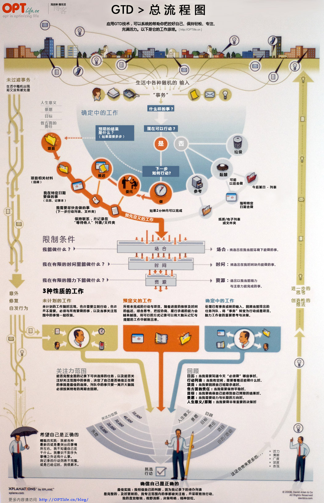
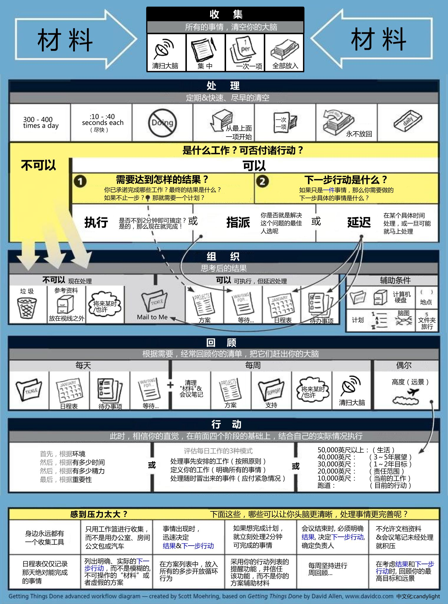
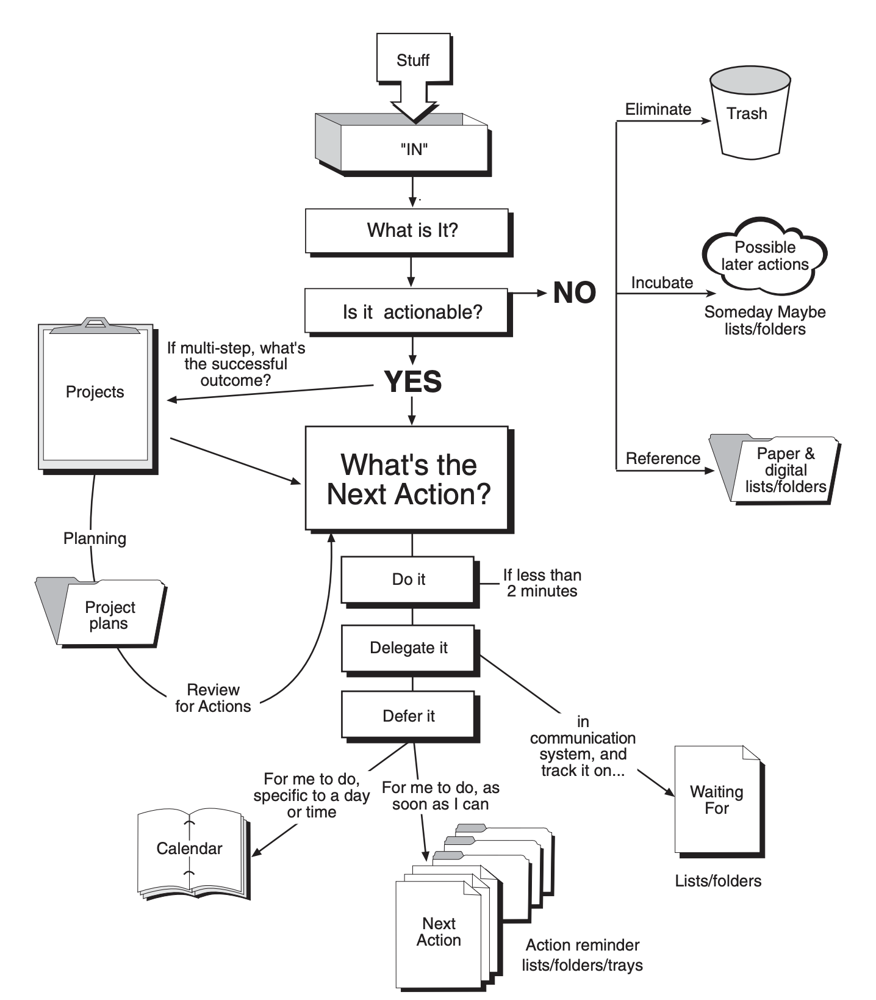

## 什么是GTD?



GTD(Getting Things Done)[^1]是一种时间管理方法，它可以帮你把生活中的大小随机事务系统化的制定成计划中的任务，解放你的大脑，帮助你更有效的去工作实现人生的目标。
让我们先回顾下平时的工作生活中大脑处理事情的过程：“某件很重要的事情，比如锻炼身体需要你每周选几天去运动，这是一件长期回报很高的目标。今天本来你需要去按计划运动，突然发生一件比较紧急但不重要的事情促使你放弃计划转而去解决这件急事，然后大概率你的计划被多件紧急不重要事情给毁了。”为什么经常会出现这种情况？因为我们的大脑在进化中就更偏向于处理急事而不是重要不紧急的事情，这是生存优先决定的，因为急事在短期可能对生活产生比较大的影响。但这却阻碍了很多重要却不紧急的长期计划目标的实现。长期目标需要按照计划来一步步推进，比如阅读习惯、写作习惯、记账习惯及很多重要技能的获得。





## 你是否需要任务管理？

如果只是简单得管理一周内得工作任务，完全可以通过日历去管理。

## Code
``` elixir
File.read!("./data.txt") 
|> String.split("\n") 
|> Enum.map(fn x -> {:ok, date, _} = DateTime.from_iso8601("2019-08-12T" <> x <> "Z"); date end) 
|> Enum.group_by(fn x -> x end) 
|> Enum.map(fn {k, v} -> [k, length(v)] end) 
|> Enum.sort(fn l, r -> l <= r end) 
|> Enum.reduce("", fn x, acc -> d = Enum.at(x, 0); acc <> "#{d.year}/#{d.month}/#{d.day} #{d.hour}:#{d.minute}:#{d.second}" <> ", #{Enum.at(x, 1)}"  <> "\n" end) |> (fn s -> File.write("./data.csv", s) end).()
```

### *References*
[^1]: <https://gettingthingsdone.com/>